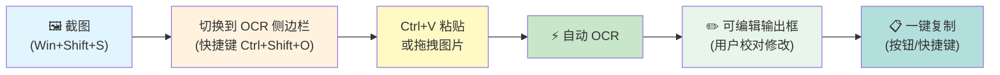
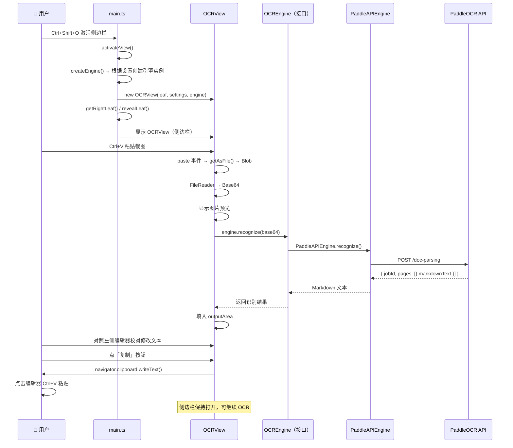

# Obsidian OCR 插件技术方案

## 一、项目概述

将现有的 Python CLI OCR 工具（`ocr_clipboard.py`）升级为一个 **Obsidian 插件**，提供可视化、可编辑的 OCR 体验。用户截图后，在侧边栏面板中粘贴图片即可自动识别文字，校对后一键复制到剪贴板，**与编辑器并排使用，无需来回切换**。

---

## 二、核心工作流



### 详细交互流程

```
1. 截图 (Win+Shift+S)
2. 按 Ctrl+Shift+O → 激活右侧 OCR 侧边栏（与编辑器并排显示）
3. 焦点切换到侧边栏，Ctrl+V 粘贴截图
4. 图片出现在预览区，自动开始 OCR
5. 2-3 秒后结果出现在下方编辑框
6. 对照原文校对修改（编辑器内容始终可见）
7. 点「复制」按钮（或 Ctrl+Enter）→ 文本进剪贴板
8. 回到编辑器 Ctrl+V 粘贴（侧边栏保持打开，可随时继续 OCR）
```

---

## 三、设计原则

| 原则 | 说明 |
|---|---|
| **所见即所得** | 侧边栏与编辑器并排，对照原文校对无需切换窗口 |
| **零额外依赖** | 仅依赖 Obsidian API + 浏览器内置 Web API，不引入第三方库 |
| **用户手势驱动** | 通过 paste/drop 事件获取图片，利用浏览器安全模型自动授权，无需额外权限 |
| **渐进增强** | 先保证核心 OCR + 编辑 + 复制流程可用，历史记录/批量/离线等作为后续扩展 |
| **容错优先** | API 未配置、网络超时、识别失败等场景均有明确提示和恢复路径 |

---

## 四、技术架构

### 4.1 项目结构

```
obsidian-ocr/
├── manifest.json              # Obsidian 插件清单
├── main.ts                    # 插件入口，注册视图和命令
├── src/
│   ├── OCRView.ts             # 侧边栏 ItemView（图片预览区 + 输出编辑区 + 按钮 + 布局图切换）
│   ├── OCREngine.ts           # OCR 引擎接口定义（抽象层）
│   ├── engines/
│   │   ├── PaddleAPIEngine.ts # PaddleOCR 云端 API 引擎（当前实现）
│   │   └── LocalDockerEngine.ts # 本地 Docker 部署引擎（预留）
│   ├── postprocess.ts         # 后处理模块：HTML 表格 → Markdown、空白裁剪、错误信息脱敏
│   ├── i18n.ts                # UI 文案常量（便于后续国际化）
│   └── settings.ts            # 设置面板（API URL / Token / 引擎选择 / fileType / 分隔符 / 表格格式）
├── styles.css                 # 侧边栏视图样式
├── package.json
├── tsconfig.json
└── esbuild.config.mjs         # 构建配置
```

> **v0.2 调整说明**：新增 `postprocess.ts`（HTML 表格转 Markdown、文本 trim）、`i18n.ts`（UI 文案抽离）；`OCRView.ts` 增加布局图（`layout_det_res`）展示支持。`fileType` 与"表格输出格式"从硬编码值改为设置项。

### 4.2 模块职责

| 模块 | 职责 |
|---|---|
| `main.ts` | 插件生命周期管理，注册 ItemView（`VIEW_TYPE_OCR`），注册命令 `Ctrl+Shift+O` 激活视图，注册 Ribbon 图标，加载设置；**保存最近一次识别结果到内存中**，供 OCRView 重建时恢复 |
| `OCRView.ts` | 侧边栏 ItemView 实现，包含图片预览区、可编辑 textarea、操作按钮、**布局检测图切换**，处理粘贴/拖拽事件，调用 OCR 引擎；**实现状态机**（空闲/加载中/成功/失败），**实现 textarea 自适应高度**，**onClose 时保存 outputArea、onOpen 时还原** |
| `OCREngine.ts` | **OCR 引擎抽象接口**，定义统一的 `recognize(base64: string): Promise<OCRResult>` 方法，供 OCRView 调用；`OCRResult` 包含 `text`、`layoutImageUrl`（来自 `outputImages.layout_det_res`） |
| `engines/PaddleAPIEngine.ts` | PaddleOCR 云端 REST API 引擎实现，封装 HTTP 请求、错误处理（含 `errorMsg` 透传）、多页结果合并、响应 trim |
| `engines/LocalDockerEngine.ts` | 本地 Docker 部署引擎预留实现，对接本地 PaddleOCR 服务（当前版本仅预留框架，设置面板中不显示相关选项） |
| `postprocess.ts` | **后处理模块**：① `htmlTableToMarkdown(html)`：将 PaddleOCR 返回的 `<table>` 转换为 Markdown 表格；② `trimText(text)`：处理响应文本首尾空白（响应中 `markdownText` 常以 `\n` 开头）；③ `sanitizeErrorMsg(msg, token)`：错误信息脱敏（去除 token 等敏感字段） |
| `i18n.ts` | **UI 文案常量**（如 `I18N.ready = '就绪'`），所有用户可见的字符串集中管理，便于后续国际化 |
| `settings.ts` | Obsidian 设置面板，存储 `apiUrl`、`token`、`engineType`（api / local）、`fileType`（1=图片，0=PDF）、`tableFormat`（'markdown' | 'html'）、`multiPageSeparator` 等配置 |
| `styles.css` | 侧边栏视图样式美化 |

### 4.3 核心设计决策

| 决策点 | 选择 | 理由 |
|---|---|---|
| UI 模式 | **侧边栏 ItemView** | 与编辑器并排显示，对照原文校对更方便；面板常驻不消失，适合连续多次 OCR |
| 视图注册 | **`registerView()` + `VIEW_TYPE_OCR`** | Obsidian 标准 ItemView 模式，支持拖拽到任意面板位置 |
| 视图激活 | **`revealLeaf()` / `activateView()` | 快捷键一键激活已有视图，不重复创建 |
| 图片获取 | **paste 事件 + `getAsFile()`** | 用户主动触发粘贴，浏览器自动授权，零权限风险 |
| HTTP 请求 | **Obsidian `requestUrl()`** | **必须用 `requestUrl()` 而非 `fetch()`**：插件渲染进程直接 `fetch()` 跨域调用云端 API 会被 CORS 拦截；`requestUrl()` 走主进程发起请求，绕过 CORS。仍属 Obsidian 内置，不破坏"零第三方依赖" |
| OCR 引擎 | **策略模式（接口 + 实现）** | 通过 `OCREngine` 接口抽象，当前实现 `PaddleAPIEngine`（云端），预留 `LocalDockerEngine`（本地框架），OCRView 只依赖接口，切换引擎无需修改视图层。**当前版本仅支持云端 API 模式**，本地模式框架已预留，待后续版本开放 |
| 图片传输 | **Base64 编码** | 无需临时文件，直接通过 JSON 传输 |
| 输出格式 | **Markdown** | PaddleOCR 原生支持，保留排版结构；**表格自动从 HTML 转为 Markdown 表格**（由 `postprocess.htmlTableToMarkdown` 处理，可在设置中选择保留 HTML） |
| 引擎返回结构 | **`OCRResult = { text, layoutImageUrl }`** | 不只返回 `text`，还把响应中的 `outputImages.layout_det_res` 带上，供侧边栏展示"布局检测结果图"辅助校对 |
| 视图状态持久化 | **OCRView 重建时恢复文本** | 用户切换布局/拖动面板时 Obsidian 可能销毁并重建 OCRView；`onClose` 时把 `outputArea.value` 存到 `main.ts` 内存，`onOpen` 时还原（图片 Blob 不持久化） |
| 并发请求 | **状态机控制 + 忽略新粘贴** | 加载中收到新粘贴直接忽略，状态栏提示"正在识别，请稍候"，避免状态错乱 |
| UI 文案 | **集中到 `i18n.ts`** | 所有用户可见字符串集中管理，便于后续国际化 |

---

## 五、关键技术细节

### 5.1 paste 事件 vs clipboard API（核心设计优势）

```typescript
// ✅ 推荐：paste 事件 — 用户主动触发，Electron 100% 支持
dropZone.addEventListener('paste', (e: ClipboardEvent) => {
    const items = e.clipboardData?.items;
    if (!items) return;
    
    for (const item of items) {
        if (item.type.startsWith('image/')) {
            const blob = item.getAsFile();  
            // getAsFile() 在 paste 事件中始终可用，无需任何权限
            if (blob) this.handleImage(blob);
        }
    }
});

// ❌ 不推荐：navigator.clipboard.read() — 需要 Clipboard API 权限
const items = await navigator.clipboard.read();  // 可能被用户拒绝
```

**`e.clipboardData.items[x].getAsFile()` 在 Electron 中总是可用的原因：**
- `paste` 事件是用户主动触发（按 Ctrl+V），浏览器自动授予临时访问权限
- `navigator.clipboard.read()` 是程序化读取，需要用户显式授予 Clipboard 权限
- 这是 Web 安全模型的核心设计：用户手势授权 vs 程序化访问

### 5.2 PaddleOCR API 调用

#### API 接口详情

| 项目 | 值 |
|---|---|
| **请求方式** | `POST {API_URL}/doc-parsing` |
| **认证头** | `Authorization: token {TOKEN}` |
| **Content-Type** | `application/json` |
| **必传参数** | `file`（Base64 编码字符串）、`fileType`（1 = 图片） |

> **注意**：API 端点为 `/doc-parsing`（对应 `--model_type doc_parsing`），而非 `/layout-parsing`。

#### 请求体格式

```json
{
    "file": "<base64 编码的图片数据>",
    "fileType": 1,
    "useDocOrientationClassify": false,
    "useDocUnwarping": false,
    "useChartRecognition": false
}
```

#### 响应体格式

> 接口为**同步**调用（POST 拿到响应即包含完整识别结果）。`jobId` 仅用于服务端日志追踪与配额统计，无需轮询。

```json
{
    "jobId": "60336188970397696",
    "pages": [
        {
            "markdownText": "\n<table border=1 style='margin: auto; word-wrap: break-word;'><tr><td style='text-align: center; word-wrap: break-word;'>关系</td>...</tr></table>",
            "markdownImages": {},
            "outputImages": {
                "layout_det_res": "https://pplines-online.bj.bcebos.com/deploy/official/paddleocr/.../layout_det_res_0.jpg?authorization=..."
            }
        }
    ]
}
```

| 字段 | 类型 | 说明 | 处理方式 |
|---|---|---|---|
| `jobId` | `string` | 服务端任务 ID | **不解析**，仅日志记录；如服务端未来改为异步，可在此字段后扩展 `recognizeAsync` |
| `pages[].markdownText` | `string` | 识别结果，**可能以 `\n` 开头**，表格以 HTML 形式出现 | ① `.trim()` 去除首尾空白；② 若设置中 `tableFormat='markdown'`，调用 `htmlTableToMarkdown` 转换 |
| `pages[].markdownImages` | `object` | 图片占位（当前版本始终为空） | 暂不处理；后续 PaddleOCR 支持后在 `postprocess.ts` 预留 `replaceImagePlaceholders` 接口 |
| `pages[].outputImages.layout_det_res` | `string` (URL) | 布局检测结果图（带 bounding box 的版面图） | 通过 `OCRResult.layoutImageUrl` 传到 `OCRView`，作为"布局视图"展示 |
| 错误响应 | `{ errorCode, errorMsg }` | 422/500 等错误时附带详细原因 | 在 `getErrorMessage` 中透传 `errorMsg`（先经 `sanitizeErrorMsg` 脱敏去掉 token） |

#### 错误码说明

| 错误码 | 说明 | 解决建议 |
|---|---|---|
| **403** | Token 错误 | 检查 Token 是否正确，或 URL 是否与 Token 匹配 |
| **413** | 请求体过大 | 请减少 PDF 文件的页数或文件大小（图片场景下通常是图片过大） |
| **422** | 参数无效 | **响应中 `errorMsg` 字段会包含详细原因**，插件会自动透传（脱敏后） |
| **429** | 超出单日解析最大页数 | 请使用其他模型或稍后再试 |
| **500** | 服务器内部错误 | 如果频繁遇到 500 问题，请联系 PaddleOCR 官方人员 |
| **503** | 当前请求过多 | 请稍后再试 |
| **504** | 网关超时 | 请稍后再试 |

#### TypeScript 调用实现

```typescript
// src/OCREngine.ts — OCR 引擎抽象接口
export interface OCRResult {
    text: string;                  // 识别结果文本
    layoutImageUrl?: string;       // 布局检测结果图 URL（来自 outputImages.layout_det_res）
}

export interface OCREngine {
    recognize(base64Data: string): Promise<OCRResult>;
}
```

```typescript
// src/engines/PaddleAPIEngine.ts — PaddleOCR 云端 API 引擎实现
import { requestUrl } from 'obsidian';
import { OCREngine, OCRResult } from '../OCREngine';
import { OCRSettings } from '../settings';
import { trimText, htmlTableToMarkdown, sanitizeErrorMsg } from '../postprocess';

export class PaddleAPIEngine implements OCREngine {
    // 持有 settings 引用（而非拷贝值），用户改配置后立即生效，避免实例持有过期 apiUrl/token
    constructor(private settings: OCRSettings) {}

    async recognize(base64Data: string): Promise<OCRResult> {
        // 用 Obsidian requestUrl() 而非 fetch()：走主进程，绕过 CORS
        const response = await requestUrl({
            url: `${this.settings.apiUrl}/doc-parsing`,
            method: 'POST',
            headers: {
                'Authorization': `token ${this.settings.token}`,
                'Content-Type': 'application/json'
            },
            body: JSON.stringify({
                file: base64Data,
                fileType: this.settings.fileType,         // 1=图片（默认），0=PDF（后续扩展）
                useDocOrientationClassify: false,
                useDocUnwarping: false,
                useChartRecognition: false,
            }),
            throw: false,   // 关闭自动抛错，由下方按状态码统一处理
        });

        if (response.status < 200 || response.status >= 300) {
            // 尝试从响应体中提取服务端 errorMsg（脱敏后透传）
            const serverMsg = (response.json as any)?.errorMsg as string | undefined;
            const safeMsg = serverMsg ? sanitizeErrorMsg(serverMsg, this.settings.token) : undefined;
            const errorMsg = this.getErrorMessage(response.status, safeMsg);
            throw new Error(errorMsg);
        }

        const data = response.json;   // requestUrl 的 json 是属性，不是方法

        // 合并所有 pages 的识别结果
        if (!data.pages || data.pages.length === 0) {
            throw new Error('OCR 未返回识别结果');
        }

        // 1. 拼接：先 trim 每页（响应文本常以 \n 开头），再按分隔符合并
        const rawText = data.pages
            .map((page: any) => trimText(page.markdownText ?? ''))
            .filter((t: string) => t !== '')
            .join(this.settings.multiPageSeparator);   // 默认 \n\n---\n\n，可在设置中改

        // 2. 表格转换：根据设置决定是否将 HTML 表格转为 Markdown 表格
        const allText = this.settings.tableFormat === 'html'
            ? rawText
            : htmlTableToMarkdown(rawText);

        if (!allText) {
            throw new Error('OCR 识别结果为空');
        }

        // 3. 提取布局检测图 URL（首页优先）
        const layoutImageUrl = data.pages?.[0]?.outputImages?.layout_det_res as string | undefined;

        return { text: allText, layoutImageUrl };
    }

    // 根据 HTTP 状态码返回用户友好的错误信息（透传服务端 errorMsg）
    private getErrorMessage(status: number, serverMsg?: string): string {
        const errorMap: Record<number, string> = {
            403: 'Token 错误，请检查 Token 是否正确，或 URL 是否与 Token 匹配',
            413: '请求体过大，请压缩图片后重试',
            422: serverMsg ? `参数无效: ${serverMsg}` : '参数无效，请检查图片格式',
            429: '超出单日解析最大页数，请稍后再试',
            500: '服务器内部错误，请稍后再试或联系 PaddleOCR 官方',
            503: '当前请求过多，请稍后再试',
            504: '网关超时，请稍后再试',
        };
        return errorMap[status] ?? `OCR API 请求失败: ${status}`;
    }
}
```

```typescript
// src/engines/LocalDockerEngine.ts — 本地 Docker 引擎（预留，待实现）
import { OCREngine, OCRResult } from '../OCREngine';

export class LocalDockerEngine implements OCREngine {
    constructor(private localUrl: string = 'http://localhost:8866') {}

    async recognize(base64Data: string): Promise<OCRResult> {
        // TODO: 对接本地 PaddleOCR Docker 服务
        // 实现时可参考 PaddleAPIEngine 的结构
        throw new Error('本地引擎尚未实现，请使用云端 API 模式');
    }
}
```

#### 5.2.1 多页分隔符策略

`pages[].markdownText` 已用 `trimText` 去除首尾空白，但多页合并仍需明确分隔符，避免出现"三空行"或页码混乱。

| 文档类型 | 推荐分隔符 | 设置项值 | 理由 |
|---|---|---|---|
| 单页图片（默认场景） | 无需拼接 | — | `pages.length === 1`，直接 trim 后使用 |
| 多页 PDF（未来扩展） | `\n\n---\n\n` | 默认值 | Markdown 标准分页符，渲染为水平分割线 |
| 用户自定义 | 任意字符串 | 用户在设置中输入 | 应对特殊场景（如 `---\n\n第 N 页\n\n---`） |

**`OCRSettings.multiPageSeparator`** 默认值为 `'\n\n---\n\n'`，在设置面板中提供"多页分隔符"输入框（多行文本）。

#### 5.2.2 后处理模块 `src/postprocess.ts`

所有"对 OCR 原始响应的二次加工"集中在 `postprocess.ts`，便于单测和复用。

```typescript
// src/postprocess.ts

// ① 文本首尾空白裁剪（响应中 markdownText 常以 \n 开头，无尾换行）
export function trimText(text: string): string {
    return text.replace(/^\s+|\s+$/g, '');
}

// ② 错误信息脱敏：移除 token 等敏感字段，避免粘贴报错时泄露
export function sanitizeErrorMsg(msg: string, token?: string): string {
    if (!msg) return msg;
    let safe = msg;
    if (token) {
        // 替换所有出现的 token
        safe = safe.split(token).join('[REDACTED]');
    }
    return safe;
}

// ③ HTML 表格 → Markdown 表格
// 入参示例（来自 PaddleOCR 响应）：
//   <table border=1 style='...'><tr><td style='text-align: center; ...'>A</td><td>B</td></tr>...</table>
// 出参示例：
//   | A | B |
//   | --- | --- |
//   | C | D |
export function htmlTableToMarkdown(html: string): string {
    if (!html || !html.includes('<table')) return html;

    // 用 DOMParser 解析（Obsidian 内置可用）
    const parser = new DOMParser();
    const doc = parser.parseFromString(`<div>${html}</div>`, 'text/html');
    const tables = doc.querySelectorAll('table');

    if (tables.length === 0) return html;

    let result = html;
    tables.forEach((table) => {
        const md = convertSingleTable(table);
        result = result.replace(table.outerHTML, md);
    });
    return result;
}

function convertSingleTable(table: HTMLTableElement): string {
    const rows = Array.from(table.querySelectorAll('tr'));
    if (rows.length === 0) return '';

    // 1. 提取所有单元格（按行展开）
    const matrix: string[][] = rows.map((tr) => {
        return Array.from(tr.querySelectorAll('th,td')).map((cell) => {
            // 去除单元格内的 HTML 标签，保留文本
            return (cell.textContent ?? '').replace(/\s+/g, ' ').trim();
        });
    });

    // 2. 补齐不齐整的列（每行按最大列数补空字符串）
    const maxCols = Math.max(...matrix.map((r) => r.length));
    matrix.forEach((r) => {
        while (r.length < maxCols) r.push('');
    });

    // 3. 构造 Markdown 表格
    const header = `| ${matrix[0].join(' | ')} |`;
    const separator = `| ${matrix[0].map(() => '---').join(' | ')} |`;
    const body = matrix.slice(1)
        .map((r) => `| ${r.join(' | ')} |`)
        .join('\n');

    return [header, separator, body].filter(Boolean).join('\n');
}
```

> **说明**：
> - `DOMParser` 是 Obsidian 渲染进程内置的浏览器 API，无需第三方库
> - 只处理 `<table>` 标签，其余 HTML 标签（如 `<b>`、`<i>`）**不做处理**，保留原始标记；如需进一步清理可加 `stripInlineTags` 函数
> - 表格中的合并单元格（`rowspan`/`colspan`）暂不处理，Markdown 表格本身不支持合并；遇到合并单元格时 PaddleOCR 通常会展开成重复单元格

#### 5.2.3 UI 文案集中化 `src/i18n.ts`

将所有用户可见字符串集中管理，便于后续国际化（v0.2 仅中文，框架预留）：

```typescript
// src/i18n.ts
export const I18N = {
    // 状态栏
    ready: '就绪',
    recognizing: '🔍 正在识别...',
    success: (n: number) => `✅ 已识别 ${n} 字符`,
    failure: (msg: string) => `❌ 识别失败: ${msg}`,
    copied: '📋 已复制到剪贴板！',
    busy: '⏳ 正在识别，请稍候...',

    // 加载态遮罩
    overlayText: '🔍 识别中...',

    // 占位符
    dropHint1: '📷 拖拽图片到此处',
    dropHint2: '或 ',
    pasteShortcut: 'Ctrl+V',
    dropHint3: ' 粘贴',

    // 按钮
    copyBtn: '📋 复制到剪贴板',
    clearBtn: '🗑️ 清除',
    retryBtn: '🔄 重试',
    switchToLayoutBtn: '🗺️ 查看布局检测',

    // Notice
    noticeNoContent: '没有可复制的内容',
    noticeCopied: '已复制到剪贴板',
    noticeNoConfig: '⚠️ 请先在设置中配置 API URL 和 Access Token',
    noticeRetryTooltip: '重新识别（包含图片压缩）',
} as const;
```

### 5.3 Base64 编码处理

```typescript
// 从 paste/drop 事件获取的 File/Blob 转为 Base64
function blobToBase64(blob: Blob): Promise<string> {
    return new Promise((resolve, reject) => {
        const reader = new FileReader();
        reader.onloadend = () => {
            const result = reader.result as string;
            // 去掉 "data:image/png;base64," 前缀，只保留纯 Base64
            const base64 = result.split(',')[1];
            resolve(base64);
        };
        reader.onerror = reject;
        reader.readAsDataURL(blob);
    });
}
```

### 5.4 侧边栏视图 UI 结构

#### Obsidian 工作区整体布局

```
┌──────────────────────────────────────────────────────┐
│  📁 文件浏览器  │  📝 编辑器（笔记内容）  │  🔍 OCR  │
│                │                        │  侧边栏   │
│  - 笔记1.md   │  # 我的笔记             │ ┌───────┐ │
│  - 笔记2.md   │                        │ │📷预览 │ │
│  - 图片/      │  这里是参考原文...      │ │ 图片  │ │
│                │                        │ └───────┘ │
│                │  用户对照原文校对 OCR   │ ┌───────┐ │
│                │  识别结果，无需切换窗口 │ │输出框 │ │
│                │                        │ │(编辑) │ │
│                │                        │ └───────┘ │
│                │                        │[📋复制]  │
│                │                        │[🗑️清除]  │
└──────────────────────────────────────────────────────┘
```

#### OCR 侧边栏内部结构

```
┌───────────────────────────┐
│     🔍 OCR 文字识别        │  ← 视图标题（Tab 标签）
├───────────────────────────┤
│  ┌─────────────────────┐  │
│  │  [原图] [🗺️布局]     │  │  ← 图片预览/拖放区
│  │  ┌───────────────┐  │  │    （顶部 Tab 切换原图/布局检测图）
│  │  │               │  │  │    （虚线边框占位）
│  │  │   图片预览     │  │  │
│  │  │  或 布局图     │  │  │
│  │  │               │  │  │
│  │  └───────────────┘  │  │
│  │  📷 拖拽或 Ctrl+V   │  │  ← 占位提示
│  └─────────────────────┘  │
│         ⬇ 自动 OCR ⬇     │
│  ┌─────────────────────┐  │
│  │ [识别的文字内容]     │  │  ← 可编辑输出框
│  │ （自适应高度）        │  │    （textarea, min/max-height 限制）
│  └─────────────────────┘  │
├───────────────────────────┤
│ 状态：✅ 已识别 128 字符   │  ← 状态栏
│ [📋 复制到剪贴板]         │  ← 按钮栏
│ [🗺️ 查看布局检测]         │  ← 仅在响应含 layout_det_res 时显示
│ [🗑️ 清除]                │
│ [🔄 重试]                │  ← 失败时显示
└───────────────────────────┘
```

> **侧边栏优势**：OCR 面板始终可见，用户在左侧编辑器中查看原文，右侧面板校对识别结果，实现"所见即所得"的校对体验。
> **新增强化**：v0.2 起，识别成功后可点击"🗺️ 查看布局检测"切换预览区显示 `layout_det_res` 布局检测图，与识别结果对照便于校对表格、标题等复杂版面。

#### 5.4.1 视图状态机

OCRView 在任意时刻处于以下状态之一：

```
            ┌──────────┐
   创建/    │  空闲    │  ← 默认状态，显示占位提示
   重置     └────┬─────┘
                 │ 用户粘贴图片
                 ▼
            ┌──────────┐
            │ 加载中   │  ← 显示遮罩 + 状态栏 "正在识别..."
            └────┬─────┘
        成功     │     失败
        ┌────────┴────────┐
        ▼                 ▼
   ┌──────────┐      ┌──────────┐
   │  成功    │      │  失败    │
   │ 显示结果  │      │ 显示重试  │
   └──────────┘      └──────────┘
```

| 当前状态 | 收到新粘贴 | 收到清除 | 备注 |
|---|---|---|---|
| 空闲 | → 加载中 | 无变化 | 正常流程 |
| 加载中 | **忽略** + 状态栏 `⏳ 正在识别，请稍候...` | 无变化 | 避免并发请求导致状态错乱 |
| 成功 | → 加载中（新图片覆盖旧结果） | → 空闲 | 正常流程 |
| 失败 | → 加载中（新图片覆盖旧结果） | → 空闲 | 正常流程 |

> **实现要点**：
> - 状态由 `OCRView.state: 'idle' | 'loading' | 'success' | 'failure'` 单一字段维护
> - 状态切换集中在 `setState(newState)` 方法，便于扩展（如加 loading 态的取消请求按钮）
> - **重试不重新走完整流程**（包括压缩判断），避免缓存压缩结果掩盖原始问题；如 `Optimization 8` 所述，重试时重新调用 `handleImage(this.lastBlob)`

#### 5.4.2 视图状态持久化

用户在 Obsidian 中拖动面板、切换布局时，OCRView 会被销毁并重建。**已校对的文本不应丢失**，但 `lastBlob`（图片 Blob）不持久化（ObjectURL 跨视图生命周期不持久，且重新走 Base64 编码是浪费）。

| 数据 | 持久化粒度 | 存储位置 | 还原时机 |
|---|---|---|---|
| `outputArea.value` | 内存 | `OCRPlugin.lastOutput: string` | `onOpen` 时检测空值时还原 |
| `previewImg.src` / `lastBlob` | ❌ 不持久化 | — | 用户需重新粘贴图片 |

**实现方式**：
```typescript
// main.ts
export default class OCRPlugin extends Plugin {
    settings: OCRSettings;
    lastOutput: string = '';   // 最近一次识别结果

    // ... existing code ...

    // 视图重建时调用
    getLastOutput(): string {
        return this.lastOutput;
    }

    saveLastOutput(text: string): void {
        this.lastOutput = text;
    }
}
```

```typescript
// OCRView.ts
async onClose() {
    // ... existing code ...
    this.plugin.saveLastOutput(this.outputArea.value);
}

async onOpen() {
    // ... existing code ...
    const last = this.plugin.getLastOutput();
    if (last && !this.outputArea.value) {
        this.outputArea.value = last;
        this.statusBar.textContent = I18N.success(last.length);
    }
}
```

#### 5.4.3 textarea 自适应高度

`outputArea` 使用 `<textarea>` 而非 `<div contenteditable>`，原因是 textarea 简单稳定、无光标跳转问题、易于选中和复制。

**自适应实现**：
```typescript
// OCRView.ts
private autoResize() {
    // 临时收起再展开以确保 scrollHeight 正确
    this.outputArea.style.height = 'auto';
    const minH = 120;   // 最小高度，约 4 行
    const maxH = 600;   // 最大高度，避免极长内容撑爆布局
    const newH = Math.min(Math.max(this.outputArea.scrollHeight, minH), maxH);
    this.outputArea.style.height = `${newH}px`;
    this.outputArea.style.overflowY = this.outputArea.scrollHeight > maxH ? 'auto' : 'hidden';
}

private registerAutoResize() {
    this.outputArea.addEventListener('input', () => this.autoResize());
    // 初始调用一次（粘贴图片后预填内容时）
    this.autoResize();
}
```

> **设计权衡**：
> - `<textarea>` vs `<div contenteditable>`：选 textarea 牺牲富文本能力，换取简单稳定
> - `min-height: 120px` 保证新粘贴时立即可见；`max-height: 600px` 避免 OCR 出长文时撑爆侧边栏（侧边栏宽度有限时尤其重要）

---

## 六、关键代码骨架

### 6.1 插件入口 `main.ts`

```typescript
import { Plugin, WorkspaceLeaf } from 'obsidian';
import { OCRView, VIEW_TYPE_OCR } from './src/OCRView';
import { OCRSettingTab, OCRSettings } from './src/settings';
import { OCREngine } from './src/OCREngine';
import { PaddleAPIEngine } from './src/engines/PaddleAPIEngine';

const DEFAULT_SETTINGS: OCRSettings = {
    engineType: 'api',                    // 'api' | 'local'（当前版本仅 api）
    apiUrl: '',
    token: '',
    localUrl: 'http://localhost:8866',
    fileType: 1,                          // 1 = 图片（默认），0 = PDF（未来扩展）
    tableFormat: 'markdown',              // 'markdown' | 'html'
    multiPageSeparator: '\n\n---\n\n',   // 多页合并分隔符
};

export default class OCRPlugin extends Plugin {
    settings: OCRSettings;
    lastOutput: string = '';               // 最近一次识别结果，用于视图重建时恢复

    // 根据设置创建 OCR 引擎实例（传入 settings 引用，配置变更后即时生效）
    private createEngine(): OCREngine {
        switch (this.settings.engineType) {
            case 'local':
                // 预留：本地 Docker 引擎
                // return new LocalDockerEngine(this.settings);
                throw new Error('本地引擎尚未实现');
            case 'api':
            default:
                return new PaddleAPIEngine(this.settings);
        }
    }

    async onload() {
        await this.loadSettings();

        // ── 注册 OCR 侧边栏视图 ──
        this.registerView(
            VIEW_TYPE_OCR,
            (leaf: WorkspaceLeaf) => new OCRView(leaf, this)
        );

        // ── Ribbon 图标（左侧栏图标按钮）──
        this.addRibbonIcon('scan', 'OCR 文字识别', () => {
            this.activateView();
        });

        // ── 注册命令：激活 OCR 侧边栏 ──
        this.addCommand({
            id: 'open-ocr-panel',
            name: '打开 OCR 侧边栏',
            // 用 'Mod' 而非 'Ctrl'：Win/Linux 映射为 Ctrl，macOS 映射为 Cmd，跨平台自适应
            hotkeys: [{ modifiers: ['Mod', 'Shift'], key: 'o' }],
            callback: () => this.activateView(),
        });

        // ── 注册设置面板 ──
        this.addSettingTab(new OCRSettingTab(this.app, this));
    }

    // ── 激活 OCR 视图（如果已存在则聚焦，否则创建）──
    async activateView() {
        const { workspace } = this.app;

        // 查找已有的 OCR 视图
        let leaf = workspace.getLeavesOfType(VIEW_TYPE_OCR)[0];
        if (!leaf) {
            // 在右侧边栏创建新 Leaf
            leaf = workspace.getRightLeaf(false);
            if (leaf) {
                await leaf.setViewState({
                    type: VIEW_TYPE_OCR,
                    active: true,
                });
            }
        }
        // 聚焦到 OCR 视图
        if (leaf) {
            workspace.revealLeaf(leaf);
        }
    }

    // ── 视图重建时供 OCRView 调用的存取接口 ──
    getLastOutput(): string {
        return this.lastOutput;
    }

    saveLastOutput(text: string): void {
        this.lastOutput = text;
    }

    async loadSettings() {
        this.settings = Object.assign({}, DEFAULT_SETTINGS, await this.loadData());
    }

    async saveSettings() {
        await this.saveData(this.settings);
    }
}
```

    // 根据设置创建 OCR 引擎实例（传入 settings 引用，配置变更后即时生效）
    private createEngine(): OCREngine {
        switch (this.settings.engineType) {
            case 'local':
                // 预留：本地 Docker 引擎
                // return new LocalDockerEngine(this.settings);
                throw new Error('本地引擎尚未实现');
            case 'api':
            default:
                return new PaddleAPIEngine(this.settings);
        }
    }

    async onload() {
        await this.loadSettings();

        // ── 注册 OCR 侧边栏视图 ──
        this.registerView(
            VIEW_TYPE_OCR,
            (leaf: WorkspaceLeaf) => new OCRView(leaf, this.settings, this.createEngine())
        );

        // ── Ribbon 图标（左侧栏图标按钮）──
        this.addRibbonIcon('scan', 'OCR 文字识别', () => {
            this.activateView();
        });

        // ── 注册命令：激活 OCR 侧边栏 ──
        this.addCommand({
            id: 'open-ocr-panel',
            name: '打开 OCR 侧边栏',
            // 用 'Mod' 而非 'Ctrl'：Win/Linux 映射为 Ctrl，macOS 映射为 Cmd，跨平台自适应
            hotkeys: [{ modifiers: ['Mod', 'Shift'], key: 'o' }],
            callback: () => this.activateView(),
        });

        // ── 注册设置面板 ──
        this.addSettingTab(new OCRSettingTab(this.app, this));
    }

    // ── 激活 OCR 视图（如果已存在则聚焦，否则创建）──
    async activateView() {
        const { workspace } = this.app;

        // 查找已有的 OCR 视图
        let leaf = workspace.getLeavesOfType(VIEW_TYPE_OCR)[0];
        if (!leaf) {
            // 在右侧边栏创建新 Leaf
            leaf = workspace.getRightLeaf(false);
            if (leaf) {
                await leaf.setViewState({
                    type: VIEW_TYPE_OCR,
                    active: true,
                });
            }
        }
        // 聚焦到 OCR 视图
        if (leaf) {
            workspace.revealLeaf(leaf);
        }
    }

    async loadSettings() {
        this.settings = Object.assign({}, DEFAULT_SETTINGS, await this.loadData());
    }

    async saveSettings() {
        await this.saveData(this.settings);
    }
}
```

### 6.2 OCRView 核心 `src/OCRView.ts`

```typescript
import { ItemView, WorkspaceLeaf, Notice } from 'obsidian';
import OCRPlugin from '../main';
import { OCREngine } from './OCREngine';
import { I18N } from './i18n';

export const VIEW_TYPE_OCR = 'ocr-panel';

// 视图状态枚举
type ViewState = 'idle' | 'loading' | 'success' | 'failure';

export class OCRView extends ItemView {
    private plugin: OCRPlugin;             // 持有 plugin 引用（用于读写 lastOutput）
    private engine: OCREngine;              // OCR 引擎实例（由 main.ts 注入）
    private state: ViewState = 'idle';      // 状态机单一字段

    private dropZone: HTMLElement;
    private previewImg: HTMLImageElement;
    private layoutImg: HTMLImageElement;    // 布局检测图（v0.2 新增）
    private placeholder: HTMLElement;
    private loadingOverlay: HTMLElement;
    private outputArea: HTMLTextAreaElement;
    private statusBar: HTMLElement;
    private retryBtn: HTMLButtonElement;
    private layoutBtn: HTMLButtonElement;   // 切换布局图按钮（v0.2 新增）
    private showingLayout: boolean = false; // 当前是否显示布局图

    private lastBlob: Blob | null = null;          // 保存最后一次图片，用于重试
    private lastLayoutImageUrl: string | null = null; // 布局图 URL

    constructor(leaf: WorkspaceLeaf, plugin: OCRPlugin) {
        super(leaf);
        this.plugin = plugin;
        this.engine = plugin.createEngine();   // 从 plugin 取引擎实例，保证配置实时同步
    }

    // ── ItemView 必须实现的属性 ──
    getViewType(): string {
        return VIEW_TYPE_OCR;
    }

    getDisplayText(): string {
        return 'OCR 文字识别';
    }

    getIcon(): string {
        return 'scan';
    }

    // ── 视图加载 ──
    async onOpen() {
        const container = this.contentEl;
        container.empty();
        container.addClass('ocr-view');

        // ── 图片拖放/粘贴区 ──
        this.dropZone = container.createEl('div', { cls: 'ocr-drop-zone' });

        this.previewImg = this.dropZone.createEl('img', { cls: 'ocr-preview' });
        this.previewImg.style.display = 'none';

        // 布局检测图（默认隐藏，识别成功后通过 layoutBtn 切换显示）
        this.layoutImg = this.dropZone.createEl('img', { cls: 'ocr-layout-img' });
        this.layoutImg.style.display = 'none';

        // ── 加载态遮罩（覆盖在图片上方）──
        this.loadingOverlay = this.dropZone.createEl('div', { cls: 'ocr-loading-overlay' });
        this.loadingOverlay.setText(I18N.overlayText);
        this.loadingOverlay.style.display = 'none';

        this.placeholder = this.dropZone.createEl('div', { cls: 'ocr-placeholder' });
        this.placeholder.createSpan({ text: I18N.dropHint1 });
        this.placeholder.createEl('br');
        this.placeholder.createSpan({ text: I18N.dropHint2 });
        this.placeholder.createEl('kbd', { text: I18N.pasteShortcut });
        this.placeholder.createSpan({ text: I18N.dropHint3 });

        // ── 输出编辑区 ──
        this.outputArea = container.createEl('textarea', { cls: 'ocr-output' });
        this.outputArea.placeholder = 'OCR 识别结果将显示在此...';

        // ── 状态栏 ──
        this.statusBar = container.createEl('div', { cls: 'ocr-status-bar' });
        this.statusBar.textContent = I18N.ready;

        // ── 按钮栏 ──
        const buttonRow = container.createEl('div', { cls: 'ocr-buttons' });

        const copyBtn = buttonRow.createEl('button', {
            text: I18N.copyBtn,
            cls: 'ocr-btn-primary'
        });
        copyBtn.addEventListener('click', () => this.copyToClipboard());

        // 布局图切换按钮（仅在响应含 layout_det_res 时显示）
        this.layoutBtn = buttonRow.createEl('button', {
            text: I18N.switchToLayoutBtn,
            cls: 'ocr-btn-layout'
        });
        this.layoutBtn.style.display = 'none';
        this.layoutBtn.addEventListener('click', () => this.toggleLayoutImage());

        const clearBtn = buttonRow.createEl('button', { text: I18N.clearBtn });
        clearBtn.addEventListener('click', () => this.clear());

        // ── 重试按钮（默认隐藏，失败时显示）──
        this.retryBtn = buttonRow.createEl('button', {
            text: I18N.retryBtn,
            cls: 'ocr-btn-retry',
            attr: { title: I18N.noticeRetryTooltip }
        });
        this.retryBtn.style.display = 'none';
        this.retryBtn.addEventListener('click', () => {
            if (this.lastBlob) this.handleImage(this.lastBlob);
        });

        // ── textarea 自适应高度 ──
        this.registerDomEvent(this.outputArea, 'input', () => this.autoResize());
        this.autoResize();

        // ── 粘贴事件（绑定到整个容器）──
        this.registerDomEvent(container, 'paste', (e: ClipboardEvent) => {
            const items = e.clipboardData?.items;
            if (!items) return;

            for (const item of items) {
                if (item.type.startsWith('image/')) {
                    const blob = item.getAsFile();
                    if (blob) {
                        e.preventDefault();
                        this.handleImage(blob);
                        return;
                    }
                }
            }
        });

        // ── 拖拽事件 ──
        this.registerDomEvent(this.dropZone, 'dragover', (e) => e.preventDefault());
        this.registerDomEvent(this.dropZone, 'drop', (e: DragEvent) => {
            e.preventDefault();
            const file = e.dataTransfer?.files?.[0];
            if (file && file.type.startsWith('image/')) {
                this.handleImage(file);
            }
        });

        // ── 快捷键：Ctrl/Cmd+Enter 复制 ──
        this.registerDomEvent(container, 'keydown', (e: KeyboardEvent) => {
            if ((e.ctrlKey || e.metaKey) && e.key === 'Enter') {
                e.preventDefault();
                this.copyToClipboard();
            }
        });

        // ── 视图状态还原（仅在 outputArea 为空时）──
        const last = this.plugin.getLastOutput();
        if (last && !this.outputArea.value) {
            this.outputArea.value = last;
            this.statusBar.textContent = I18N.success(last.length);
            this.setState('success');
            this.autoResize();
        }
    }

    // ── 视图关闭（清理资源 + 持久化已校对文本）──
    async onClose() {
        // 释放 ObjectURL
        if (this.previewImg.src && this.previewImg.src.startsWith('blob:')) {
            URL.revokeObjectURL(this.previewImg.src);
        }
        // 持久化已校对文本到 plugin 内存
        this.plugin.saveLastOutput(this.outputArea.value);
    }

    // ── 状态机切换 ──
    private setState(newState: ViewState) {
        this.state = newState;
        // 根据状态控制按钮可见性
        this.retryBtn.style.display = newState === 'failure' ? '' : 'none';
    }

    // ── 处理图片 ──
    private async handleImage(blob: Blob) {
        // ── 并发控制：加载中收到新粘贴直接忽略 ──
        if (this.state === 'loading') {
            this.statusBar.textContent = I18N.busy;
            new Notice(I18N.busy);
            return;
        }

        // 设置校验：调用前检查配置
        const settings = this.plugin.settings;
        if (!settings.apiUrl || !settings.token) {
            new Notice(I18N.noticeNoConfig);
            return;
        }

        // 标记为加载中
        this.setState('loading');

        // 保存 blob 用于重试
        this.lastBlob = blob;
        this.lastLayoutImageUrl = null;
        this.layoutBtn.style.display = 'none';
        this.showingLayout = false;

        // 释放旧的 ObjectURL
        if (this.previewImg.src && this.previewImg.src.startsWith('blob:')) {
            URL.revokeObjectURL(this.previewImg.src);
        }

        // 显示原图预览
        const url = URL.createObjectURL(blob);
        this.previewImg.src = url;
        this.previewImg.style.display = 'block';
        this.layoutImg.style.display = 'none';
        this.placeholder.style.display = 'none';

        // Base64 编码
        const base64 = await this.blobToBase64(blob);

        // 显示加载态遮罩
        this.loadingOverlay.style.display = 'flex';
        this.statusBar.textContent = I18N.recognizing;

        try {
            // 通过引擎接口调用，返回 OCRResult（含 layoutImageUrl）
            const result = await this.engine.recognize(base64);
            this.outputArea.value = result.text;
            this.statusBar.textContent = I18N.success(result.text.length);
            this.plugin.saveLastOutput(result.text);
            this.setState('success');
            this.autoResize();

            // 若响应含布局图，显示切换按钮
            if (result.layoutImageUrl) {
                this.layoutImg.src = result.layoutImageUrl;
                this.lastLayoutImageUrl = result.layoutImageUrl;
                this.layoutBtn.style.display = '';
            }
        } catch (err) {
            const msg = err instanceof Error ? err.message : '未知错误';
            this.statusBar.textContent = I18N.failure(msg);
            new Notice(`OCR 识别失败: ${msg}`);
            this.setState('failure');
        } finally {
            this.loadingOverlay.style.display = 'none';
        }
    }

    // ── 切换显示原图 / 布局图 ──
    private toggleLayoutImage() {
        this.showingLayout = !this.showingLayout;
        if (this.showingLayout) {
            this.previewImg.style.display = 'none';
            this.layoutImg.style.display = 'block';
            this.layoutBtn.setText('🖼️ 查看原图');
        } else {
            this.previewImg.style.display = 'block';
            this.layoutImg.style.display = 'none';
            this.layoutBtn.setText(I18N.switchToLayoutBtn);
        }
    }

    // ── textarea 自适应高度 ──
    private autoResize() {
        this.outputArea.style.height = 'auto';
        const minH = 120;
        const maxH = 600;
        const newH = Math.min(Math.max(this.outputArea.scrollHeight, minH), maxH);
        this.outputArea.style.height = `${newH}px`;
        this.outputArea.style.overflowY = this.outputArea.scrollHeight > maxH ? 'auto' : 'hidden';
    }

    // ── 复制到剪贴板 ──
    private async copyToClipboard() {
        const text = this.outputArea.value;
        if (!text) {
            new Notice(I18N.noticeNoContent);
            return;
        }
        await navigator.clipboard.writeText(text);
        this.statusBar.textContent = I18N.copied;
        new Notice(I18N.noticeCopied);
    }

    // ── 清除 ──
    private clear() {
        this.outputArea.value = '';
        this.plugin.saveLastOutput('');
        if (this.previewImg.src && this.previewImg.src.startsWith('blob:')) {
            URL.revokeObjectURL(this.previewImg.src);
        }
        this.previewImg.src = '';
        this.layoutImg.src = '';
        this.lastLayoutImageUrl = null;
        this.previewImg.style.display = 'none';
        this.layoutImg.style.display = 'none';
        this.placeholder.style.display = '';
        this.loadingOverlay.style.display = 'none';
        this.retryBtn.style.display = 'none';
        this.layoutBtn.style.display = 'none';
        this.lastBlob = null;
        this.showingLayout = false;
        this.statusBar.textContent = I18N.ready;
        this.outputArea.style.height = '';
        this.setState('idle');
    }

    // ── Blob → Base64 ──
    private blobToBase64(blob: Blob): Promise<string> {
        return new Promise((resolve, reject) => {
            const reader = new FileReader();
            reader.onloadend = () => resolve((reader.result as string).split(',')[1]);
            reader.onerror = reject;
            reader.readAsDataURL(blob);
        });
    }
}
```

### 6.3 加载态样式 `styles.css`（关键片段）

```css
/* 图片拖放区（需要 relative 定位，供 loading 遮罩 absolute 参考） */
.ocr-drop-zone {
    position: relative;
}

/* 加载态遮罩 */
.ocr-loading-overlay {
    position: absolute;
    inset: 0;
    display: flex;
    align-items: center;
    justify-content: center;
    background: rgba(0, 0, 0, 0.5);
    color: #fff;
    font-size: 1.1em;
    border-radius: 8px;
    z-index: 10;
    animation: ocr-pulse 1.5s ease-in-out infinite;
}

@keyframes ocr-pulse {
    0%, 100% { opacity: 0.7; }
    50% { opacity: 1; }
}

/* 重试按钮 */
.ocr-btn-retry {
    background: var(--text-warning);
    color: var(--text-on-warning);
}
```

---

## 七、设置面板

### 配置项

| 设置项 | 类型 | 说明 | 默认值 |
|---|---|---|---|
| **API URL** | `string` | PaddleOCR API 地址，从 [AI Studio](https://aistudio.baidu.com/paddleocr/task) 获取 | 空 |
| **Access Token** | `string`（密码字段） | PaddleOCR 访问令牌 | 空 |
| **输入类型 (fileType)** | `dropdown` | 上传文件的类型：`1 = 图片` / `0 = PDF`（PDF 暂未启用 UI 入口） | `1` |
| **表格输出格式** | `dropdown` | 表格的呈现方式：`Markdown 表格` / `保留 HTML` | `Markdown 表格` |
| **多页分隔符** | `string`（多行文本） | 多页识别结果之间的分隔符，Markdown 标准分页符为 `\n\n---\n\n` | `\n\n---\n\n` |

> **注意**：引擎类型选择和本地服务地址配置已预留框架（见 4.2 模块职责），但当前版本仅支持云端 API 模式，设置面板中暂不显示相关选项。后续版本支持本地模式时再开放。
> **v0.2 新增**：表格输出格式 + 多页分隔符两个选项，默认配置下用户无需调整即可获得良好体验。

### 获取 Token 和 API URL

1. 访问 [PaddleOCR 官网](https://aistudio.baidu.com/paddleocr/task)
2. 在 API 调用示例中获取 `API_URL` 和 `TOKEN`
3. 填入插件的设置面板

### 表格输出格式示例

启用 "Markdown 表格"（默认）后，PaddleOCR 返回的 HTML 表格会被自动转换为：

**PaddleOCR 原始返回**（来自 `result.json`）：
```html
<table border=1 style='margin: auto; word-wrap: break-word;'>
  <tr><td style='text-align: center'>关系</td><td>具体表现</td><td>毛泽东思想</td><td>中国特色社会主义理论体系</td></tr>
  <tr><td>不同点</td><td>时代背景不同</td><td>战争与革命</td><td>和平与发展</td></tr>
</table>
```

**复制到 Obsidian 笔记后**：
```markdown
| 关系 | 具体表现 | 毛泽东思想 | 中国特色社会主义理论体系 |
| --- | --- | --- | --- |
| 不同点 | 时代背景不同 | 战争与革命 | 和平与发展 |
```

如选择"保留 HTML"，则按原始 HTML 字符串原样输出，适合需要粘贴到非 Markdown 场景（如富文本编辑器、邮件）的用户。

---

## 八、工作流完整流程

### 用户操作流程

```
┌──────────────────────────────────────────────────────────┐
│  步骤 1: 截图                                             │
│  按 Win+Shift+S，框选需要 OCR 的区域                       │
├──────────────────────────────────────────────────────────┤
│  步骤 2: 打开 OCR 侧边栏                                   │
│  在 Obsidian 中按 Ctrl+Shift+O                           │
│  → 右侧边栏出现 OCR 面板，与编辑器并排显示                   │
├──────────────────────────────────────────────────────────┤
│  步骤 3: 粘贴截图                                         │
│  按 Ctrl+V（或拖拽图片到虚线框）                           │
│  → 图片显示在预览区                                       │
│  → 自动开始 OCR 识别                                      │
├──────────────────────────────────────────────────────────┤
│  步骤 4: 等待识别                                         │
│  → 状态栏显示 "🔍 正在识别..."                            │
│  → 2-3 秒后结果显示在下方编辑框                            │
│  → 状态栏显示 "✅ 已识别 N 字符"                          │
├──────────────────────────────────────────────────────────┤
│  步骤 5: 校对修改                                         │
│  左侧编辑器显示原文，右侧面板对照校对                       │
│  在输出框中直接编辑，修正可能存在的识别错误                  │
├──────────────────────────────────────────────────────────┤
│  步骤 6: 复制结果                                         │
│  点击「📋 复制到剪贴板」按钮（或按 Ctrl+Enter）            │
│  → 状态栏显示 "📋 已复制到剪贴板！"                        │
├──────────────────────────────────────────────────────────┤
│  步骤 7: 粘贴到编辑器                                      │
│  点击左侧编辑器获取焦点                                    │
│  Ctrl+V 粘贴文本（OCR 面板保持打开，可继续使用）             │
└──────────────────────────────────────────────────────────┘
```

### 系统内部流程



---

## 九、依赖与兼容性

### 零第三方依赖

| 依赖 | 来源 | 说明 |
|---|---|---|
| `obsidian` | Obsidian API | 插件运行时由 Obsidian 提供 |
| `requestUrl()` | Obsidian API | Obsidian 内置的 HTTP 请求方法，绕过 CORS（**不用浏览器 `fetch()`**） |
| `FileReader` | 浏览器内置 | 标准 Web API，无需安装 |
| `navigator.clipboard` | 浏览器内置 | 标准 Web API，无需安装 |

**不需要 pip 安装任何 Python 包，不需要 Node.js 额外依赖。**

### 平台兼容性

| 平台 | 支持 | 说明 |
|---|---|---|
| Windows | ✅ | 主要目标平台，Win+Shift+S 截图 |
| macOS | ✅ | Cmd+Shift+4 截图，快捷键适配 Cmd |
| Linux | ✅ | 取决于桌面环境的截图工具 |

---

## 十、工作量估算

> **v0.2 调整**：新增 `postprocess.ts`（HTML 表格转换 + 文本 trim + 错误脱敏）、`i18n.ts`、布局图切换、状态机与持久化、表格输出格式与多页分隔符设置项；总工时相应增加。

| 阶段 | 模块 | 工时 | 说明 |
|---|---|---|---|
| 1 | 项目脚手架 | 0.5h | manifest.json / tsconfig / esbuild 配置 |
| 2 | OCRView UI | 3h | 图片预览区 + 输出框 + 按钮栏 + 拖放区 + 加载态遮罩 + 响应式布局 + **布局图切换** + **textarea 自适应** |
| 3 | 粘贴/拖拽事件 | 1h | paste + drop 事件处理 + Base64 编码 + 图片压缩 + 网络检测 |
| 4 | PaddleOCR API | 1.5h | requestUrl 封装 + 错误处理（含 `errorMsg` 透传）+ 多页结果合并 + **返回 OCRResult** + 设置校验 + 超时控制 |
| 5 | **后处理模块** | 1.5h | **`htmlTableToMarkdown`（DOMParser 解析 + 列对齐）** + `trimText` + `sanitizeErrorMsg` + 基础单测 |
| 6 | 设置面板 | 1.5h | API URL / Token / **fileType** / **tableFormat** / **multiPageSeparator** + 密码字段遮蔽 + 配置验证 |
| 7 | 样式美化 | 1.5h | 侧边栏视觉设计 + 虚线框 + 加载动画 + 重试按钮 + 响应式适配 |
| 8 | 状态机与持久化 | 0.5h | `setState` 状态机 + 并发控制 + `lastOutput` 内存持久化 |
| 9 | i18n 框架 | 0.3h | UI 文案抽离到 `i18n.ts` |
| 10 | 离线降级处理 | 0.5h | 网络检测 + 本地服务检查 + 降级提示逻辑 |
| 11 | 测试调试 | 2.5h | 端到端 + **HTML 表格转换测试** + 边界情况 + 兼容性 + 错误场景 |
| 12 | 文档与打包 | 0.5h | README 编写 + 构建产物整理 + 本地安装测试 |
| **合计** | | **≈ 14.3h** | 预留 1.5-2h 缓冲，总计 14-16h |

> **工时说明**：
> - v0.2 比 v0.1（11h）增加约 3.3 小时，主要新增在 HTML 表格转换、布局图切换、状态机与持久化、扩展设置项
> - 实际开发中可能因 Obsidian API 细节问题需要额外调试时间
> - 建议分 3-4 天完成，每天 4 小时，避免疲劳导致的代码质量下降

---

## 十一、性能优化策略

### 11.1 图片压缩

对于大图片（超过阈值），在转 Base64 前进行压缩，减少传输数据量和处理时间。**压缩策略需平衡文件大小与 OCR 精度**，避免过度压缩导致识别率下降。**v0.2 起阈值可在设置中调整**（默认 10MB），对屏幕字体小的截图建议调大（如 15-20MB）。

#### 压缩策略

| 条件 | 处理方式 | 目标 |
|---|---|---|
| **文件大小 ≤ 阈值** | 不压缩，直接使用 | 保持原始质量 |
| **文件大小 > 阈值** | 按比例缩放 + 质量压缩 | 降至阈值以内 |
| **分辨率 > 4000px 宽** | 缩放至 4000px 宽（保持宽高比） | 避免超大图片处理超时 |
| **分辨率 < 800px 宽** | 不压缩（即使文件较大） | 保证 OCR 识别精度 |

#### OCR 精度保护原则

1. **最小分辨率保障**：压缩后图片宽度不低于 800px，确保文字清晰可辨
2. **优先缩放尺寸**：先调整分辨率，再压缩质量，减少对文字边缘的损失
3. **质量下限**：JPEG 质量不低于 0.7，避免产生明显噪点干扰 OCR
4. **格式选择**：优先使用 PNG（无损），仅在文件过大时转为 JPEG

#### 实现代码

```typescript
// 压缩配置常量
const COMPRESS_CONFIG = {
    MAX_FILE_SIZE_MB: 10,        // 触发压缩的文件大小阈值
    MAX_WIDTH_PX: 4000,          // 最大宽度限制
    MIN_WIDTH_PX: 800,           // 最小宽度保障（OCR 精度）
    JPEG_QUALITY: 0.8,           // JPEG 压缩质量（0.7-0.9 适合 OCR）
    PREFER_FORMAT: 'image/png',  // 优先使用 PNG（无损）
};

// 图片压缩函数
async function compressImage(blob: Blob): Promise<Blob> {
    const sizeMB = blob.size / (1024 * 1024);
    
    // 小文件直接返回
    if (sizeMB <= COMPRESS_CONFIG.MAX_FILE_SIZE_MB) {
        return blob;
    }

    return new Promise((resolve, reject) => {
        const img = new Image();
        img.onload = () => {
            const canvas = document.createElement('canvas');
            const ctx = canvas.getContext('2d')!;
            
            let targetWidth = img.width;
            let targetHeight = img.height;
            
            // 1. 限制最大宽度（避免超大图片）
            if (targetWidth > COMPRESS_CONFIG.MAX_WIDTH_PX) {
                const ratio = COMPRESS_CONFIG.MAX_WIDTH_PX / targetWidth;
                targetWidth = COMPRESS_CONFIG.MAX_WIDTH_PX;
                targetHeight = Math.round(img.height * ratio);
            }
            
            // 2. 保障最小宽度（OCR 精度）
            if (targetWidth < COMPRESS_CONFIG.MIN_WIDTH_PX) {
                console.warn(`图片宽度 ${targetWidth}px 较小，可能影响 OCR 精度`);
                // 不放大，保持原始尺寸
                targetWidth = img.width;
                targetHeight = img.height;
            }
            
            canvas.width = targetWidth;
            canvas.height = targetHeight;
            
            // 绘制缩放后的图片
            ctx.drawImage(img, 0, 0, targetWidth, targetHeight);
            
            // 3. 尝试 PNG 格式（无损）
            canvas.toBlob(
                (pngBlob) => {
                    if (pngBlob && pngBlob.size / (1024 * 1024) <= COMPRESS_CONFIG.MAX_FILE_SIZE_MB) {
                        resolve(pngBlob);
                    } else {
                        // PNG 仍然过大，使用 JPEG 压缩
                        canvas.toBlob(
                            (jpegBlob) => resolve(jpegBlob!),
                            'image/jpeg',
                            COMPRESS_CONFIG.JPEG_QUALITY
                        );
                    }
                },
                COMPRESS_CONFIG.PREFER_FORMAT
            );
        };
        img.onerror = reject;
        img.src = URL.createObjectURL(blob);
    });
}

// 使用示例
async function handleImageWithCompression(blob: Blob) {
    const originalSize = (blob.size / (1024 * 1024)).toFixed(2);
    const compressedBlob = await compressImage(blob);
    const compressedSize = (compressedBlob.size / (1024 * 1024)).toFixed(2);
    
    if (blob !== compressedBlob) {
        new Notice(`📦 图片已压缩: ${originalSize}MB → ${compressedSize}MB`);
    }
    
    // 继续处理...
}
```

**使用场景**：
- 在 `handleImage()` 中，Base64 编码前调用 `compressImage()`
- 超过 10MB 的图片自动压缩
- 压缩后显示提示："图片已压缩至 X MB"
- 如果图片宽度小于 800px，控制台警告可能影响精度

### 11.2 网络状态检测与离线降级

在发起 API 请求前检测网络状态，避免无效请求。**当网络不可用时，根据当前引擎类型提供相应的降级提示**。

> **范围说明（重要）**：
> - 当前版本仅开放云端 API 模式，`case 'local'` 分支与 `checkLocalService()` 属于**为未来本地引擎预留的代码**，本版本运行时不会进入——建议实现时再补，避免现在引入无法测试的死代码（`§13` 中 3 条"本地模式"测试用例同样应推迟到本地引擎开放后）。
> - `navigator.onLine` 只反映网卡连接状态，无法保证目标 API 可达，仅作粗筛；真正的失败仍以 `requestUrl` 的状态码/异常为准。
> - 下方 `checkLocalService()` 示例用 `fetch`，实现时同样应改为 Obsidian `requestUrl()`（localhost 不同端口仍属跨域）。

#### 离线降级策略

| 场景 | 当前引擎 | 提示信息 | 操作建议 |
|---|---|---|---|
| 网络断开 | 云端 API | "⚠️ 网络不可用，云端 OCR 无法使用" | 提示切换本地模式或检查网络 |
| 网络断开 + 本地引擎未部署 | 本地 Docker | "⚠️ 本地 OCR 服务未部署" | 提示部署本地服务 |
| 网络断开 + 本地引擎已配置 | 本地 Docker | 继续使用本地服务 | 正常工作 |

#### 实现代码

```typescript
// 网络状态检测
function isOnline(): boolean {
    return navigator.onLine;
}

// 离线降级处理
function handleOfflineScenario(settings: OCRSettings): boolean {
    if (isOnline()) {
        return true; // 网络正常，继续执行
    }
    
    // 网络断开时的处理逻辑
    switch (settings.engineType) {
        case 'api':
            // 云端 API 模式：提示切换本地模式
            new Notice('⚠️ 网络不可用，云端 OCR 无法使用。\n请切换到本地模式或检查网络连接。', 5000);
            return false;
            
        case 'local':
            // 本地模式：检查本地服务是否可用
            // 这里可以尝试 ping 本地服务
            checkLocalService(settings.localUrl)
                .then(isAvailable => {
                    if (!isAvailable) {
                        new Notice('⚠️ 本地 OCR 服务未部署或未启动。\n请先部署本地 PaddleOCR 服务。', 8000);
                    }
                });
            return true; // 让用户尝试连接本地服务
            
        default:
            new Notice('⚠️ 网络不可用，请检查网络连接。', 5000);
            return false;
    }
}

// 检查本地服务是否可用
async function checkLocalService(localUrl: string): Promise<boolean> {
    try {
        const response = await fetch(`${localUrl}/health`, {
            method: 'GET',
            signal: AbortSignal.timeout(3000) // 3秒超时
        });
        return response.ok;
    } catch {
        return false;
    }
}

// 在 handleImage() 中使用
private async handleImage(blob: Blob) {
    // 检查网络状态和引擎可用性
    if (!handleOfflineScenario(this.settings)) {
        return;
    }
    
    // 继续原有逻辑...
}
```

#### 用户提示示例

**场景 1：云端模式 + 网络断开**
```
⚠️ 网络不可用，云端 OCR 无法使用。
请切换到本地模式或检查网络连接。
```

**场景 2：本地模式 + 服务未部署**
```
⚠️ 本地 OCR 服务未部署或未启动。
请先部署本地 PaddleOCR 服务。
部署指南：https://github.com/PaddlePaddle/PaddleOCR
```

**场景 3：本地模式 + 服务正常**
```
✅ 使用本地 OCR 服务（离线模式）
```

### 11.3 请求超时控制

为 API 请求设置合理的超时时间（如 30 秒），避免长时间等待。

> **注意**：Obsidian 的 `requestUrl()` 不支持 `AbortController` / `signal`，因此不能用 `AbortSignal.timeout` 实现超时。改用 `Promise.race` 包一层超时竞速。

```typescript
import { requestUrl, RequestUrlParam, RequestUrlResponse } from 'obsidian';

// 带超时的 requestUrl（用 Promise.race 实现，因 requestUrl 不支持 abort）
async function requestWithTimeout(
    params: RequestUrlParam,
    timeout: number = 30000
): Promise<RequestUrlResponse> {
    const timeoutPromise = new Promise<never>((_, reject) =>
        setTimeout(() => reject(new Error('请求超时，请稍后再试')), timeout)
    );
    return Promise.race([requestUrl(params), timeoutPromise]);
}
```

> 说明：`Promise.race` 超时后底层 `requestUrl` 仍会在后台跑完，但其结果被丢弃，不影响用户体验。`PaddleAPIEngine.recognize()` 内部即可改用 `requestWithTimeout` 替代直接 `requestUrl`。

### 11.4 图片尺寸限制

在图片预处理阶段检查尺寸，超出限制时给出提示。

```typescript
// 图片尺寸检查
const MAX_IMAGE_SIZE = 10 * 1024 * 1024; // 10MB

async function validateAndCompressImage(blob: Blob): Promise<Blob> {
    if (blob.size > MAX_IMAGE_SIZE) {
        new Notice('⚠️ 图片较大，正在压缩...');
        return await compressImage(blob, MAX_IMAGE_SIZE / (1024 * 1024));
    }
    return blob;
}
```

---

## 十二、风险与对策

| 风险 | 概率 | 影响 | 对策 |
|---|---|---|---|
| PaddleOCR API 不可用/限流 | 低 | 高 | 在设置面板中显示配额信息，推荐用户关注 API 配额；失败时显示重试按钮 |
| 大图片 Base64 编码超时 | 中 | 中 | 限制图片大小（如超过 10MB 提示压缩），加载态遮罩提供视觉反馈 |
| ObjectURL 内存泄漏 | 中 | 中 | 每次新图片/清除/关闭视图前调用 `URL.revokeObjectURL()` |
| API 响应结构变更 | 低 | 中 | 对 `pages` 做空值保护，异常时给出明确错误提示 |
| Obsidian API 版本不兼容 | 低 | 中 | 在 manifest.json 中声明最低版本要求 |
| 快捷键 Ctrl+Shift+O 冲突 | 低 | 低 | 文档中提示用户可在 Obsidian 设置中自定义快捷键 |
| **网络断开导致云端 OCR 不可用** | 中 | 高 | 自动检测网络状态，提示切换本地模式；本地模式下检查服务可用性，未部署时提供部署指南链接 |
| **图片过度压缩导致 OCR 精度下降** | 低 | 中 | 压缩策略保障最小分辨率（800px），优先缩放尺寸再压缩质量，质量下限 0.7 |
| **本地 PaddleOCR 服务未部署** | 中 | 中 | 在离线提示中提供部署指南链接，引导用户完成本地服务搭建 |

---

## 十三、测试策略

### 13.1 测试用例矩阵

| 测试类别 | 测试场景 | 预期结果 | 优先级 |
|---|---|---|---|
| **正常功能** | 粘贴小图片（<1MB） | 成功识别并显示结果 | P0 |
| **正常功能** | 拖拽图片到预览区 | 成功识别并显示结果 | P0 |
| **正常功能** | 点击复制按钮 | 文本复制到剪贴板 | P0 |
| **正常功能** | 按 Ctrl+Enter | 文本复制到剪贴板 | P0 |
| **边界情况** | 粘贴大图片（>10MB） | 自动压缩后成功识别 | P1 |
| **边界情况** | 粘贴空图片/无效图片 | 显示错误提示 | P1 |
| **边界情况** | OCR 返回空结果 | 显示"识别结果为空"提示 | P1 |
| **边界情况** | 连续粘贴多张图片 | 每次都能正确识别 | P1 |
| **错误处理** | Token 无效（403） | 显示"Token 错误"提示 | P0 |
| **错误处理** | 请求体过大（413） | 显示"请求体过大"提示 | P1 |
| **错误处理** | 参数无效（422） | 显示具体错误信息 | P1 |
| **错误处理** | 超出配额（429） | 显示"超出配额"提示 | P1 |
| **错误处理** | 服务器错误（500） | 显示"服务器错误"提示 | P1 |
| **错误处理** | 请求过多（503） | 显示"请求过多"提示 | P1 |
| **错误处理** | 网关超时（504） | 显示"网关超时"提示 | P1 |
| **错误处理** | 网络断开 | 显示"网络不可用"提示 | P0 |
| **错误处理** | API 未配置 | 显示"请先配置 API"提示 | P0 |
| **错误处理** | 网络断开 + 云端模式 | 显示"网络不可用，请切换本地模式"提示 | P0 |
| **错误处理** | 网络断开 + 本地模式 + 服务未部署 | 显示"本地服务未部署"提示及部署指南 | P1 |
| **错误处理** | 网络断开 + 本地模式 + 服务正常 | 使用本地服务正常识别 | P1 |
| **资源管理** | 切换图片时释放旧 ObjectURL | 无内存泄漏 | P2 |
| **资源管理** | 关闭视图时释放资源 | 无内存泄漏 | P2 |
| **UI 交互** | 加载态遮罩显示 | 遮罩正确显示/隐藏 | P1 |
| **UI 交互** | 重试按钮显示/隐藏 | 失败时显示，成功时隐藏 | P1 |
| **UI 交互** | 状态栏信息更新 | 实时更新识别状态 | P1 |
| **正常功能** | 识别图片中的表格 | 表格以 Markdown 格式输出（启用转换后） | P0 |
| **正常功能** | 响应中含 layout_det_res | 布局检测图按钮显示，点击可切换预览 | P1 |
| **正常功能** | 切换"原图/布局图" | previewImg 和 layoutImg 互斥显示 | P1 |
| **边界情况** | 加载中再次粘贴 | 忽略新粘贴，状态栏提示"正在识别" | P1 |
| **边界情况** | 视图关闭后重开 | 已校对文本从 `lastOutput` 还原 | P1 |
| **边界情况** | 多页响应合并 | 多页用 `multiPageSeparator` 正确拼接 | P1 |
| **错误处理** | 422 响应含 errorMsg | 错误提示包含服务端具体原因（脱敏后） | P1 |
| **UI 交互** | 暗色主题 + HTML 表格预览 | 表格边框、对比度可读 | P1 |
| **UI 交互** | textarea 极长内容 | 不撑爆布局（max-height 生效） | P1 |
| **UI 交互** | 设置中改表格输出格式为 HTML | 识别结果保留原始 HTML 表格 | P1 |
| **后处理** | 单列/多列/空表格转换 | 转换结果列数对齐、行为空字符串补齐 | P1 |
| **后处理** | 文本首尾空白处理 | 复制到笔记后无多余空行 | P1 |

### 13.2 测试工具与方法

| 测试类型 | 工具/方法 | 说明 |
|---|---|---|
| **端到端测试** | 手动测试 | **优先级最高**，完整用户流程测试，在 Obsidian 中实际操作 |
| **集成测试** | Obsidian 开发者控制台 | 测试插件加载、视图注册、事件绑定 |
| **边界测试** | 准备测试图片集 | 包含不同尺寸、格式、质量的图片 |
| **错误测试** | 模拟网络断开/无效 Token | 测试错误处理逻辑 |
| **单元测试** | Jest（可选） | 后续优化时添加，测试独立函数如 Base64 编码、图片压缩等 |

> **测试策略说明**：由于 Obsidian 插件的测试环境搭建比较复杂，**优先保证手动测试覆盖核心流程**。单元测试作为后续优化方向，在插件稳定运行后再考虑添加。

### 13.3 测试图片集

准备以下测试图片：

| 图片类型 | 尺寸 | 大小 | 用途 |
|---|---|---|---|
| 小图片 | 800x600 | <1MB | 正常功能测试 |
| 中图片 | 1920x1080 | 2-5MB | 性能测试 |
| 大图片 | 4000x3000 | >10MB | 压缩功能测试 |
| 超大图片 | 8000x6000 | >20MB | 边界测试 |
| 空图片 | 0x0 | 0KB | 错误处理测试 |
| 无效文件 | - | - | 错误处理测试 |
| 小分辨率图片 | 400x300 | <500KB | OCR 精度保障测试（验证最小分辨率提示） |
| 高质量 PNG | 2000x1500 | 15MB | PNG 格式优先测试 |
| 低质量 JPEG | 2000x1500 | 500KB | 压缩质量下限测试 |

### 13.4 测试流程

1. **开发阶段**：每个功能完成后立即测试
2. **集成阶段**：所有功能完成后进行端到端测试
3. **发布前**：完整测试矩阵覆盖
4. **发布后**：收集用户反馈，持续改进

---

## 十四、部署与发布

### 14.1 构建插件

```bash
# 安装依赖
npm install

# 构建生产版本
npm run build
```

构建后生成以下文件（用于发布）：
- `main.js` — 编译后的插件代码
- `manifest.json` — 插件清单
- `styles.css` — 样式文件

### 14.2 本地安装测试

1. 在 Obsidian 库目录下创建 `.obsidian/plugins/obsidian-ocr/` 文件夹
2. 将 `main.js`、`manifest.json`、`styles.css` 复制到该文件夹
3. 在 Obsidian 设置 → 第三方插件中启用该插件

### 14.3 发布到 Obsidian 社区插件

1. **准备 GitHub 仓库**
   - 创建公开仓库（如 `obsidian-ocr`）
   - 推送代码并创建 Release（Tag 格式需与 `manifest.json` 中的版本号一致）
   - Release 包含 `main.js`、`manifest.json`、`styles.css` 三个文件

2. **提交到 Obsidian 插件仓库**
   - Fork [obsidianmd/obsidian-releases](https://github.com/obsidianmd/obsidian-releases)
   - 在 `community-plugins.json` 中添加插件信息：
     ```json
     {
         "id": "obsidian-ocr",
         "name": "OCR 文字识别",
         "author": "Your Name",
         "description": "截图 OCR 文字识别，侧边栏可视化校对，一键复制",
         "repo": "your-username/obsidian-ocr"
     }
     ```
   - 提交 PR，等待审核通过

3. **版本更新流程**
   - 更新 `manifest.json` 中的版本号
   - 更新 `versions.json`（记录版本与最低 Obsidian 版本的映射）
   - 创建新的 GitHub Release
   - Obsidian 社区插件会自动检测更新

### 14.4 目录结构（构建产物）

```
.obsidian/plugins/obsidian-ocr/
├── main.js              # 编译后的插件代码
├── manifest.json        # 插件清单
└── styles.css           # 样式文件
```

---

## 十五、后续扩展方向

- [ ] **历史记录**：保存最近的 OCR 结果，支持回溯
- [ ] **批量处理**：支持一次粘贴多张图片，逐张识别，结果追加
- [ ] **三栏对照模式**：在"原图 / 布局图 / 文本"三栏之间切换，用户一边校对一边看到定位
- [ ] **语言选择**：在设置中指定 OCR 目标语言
- [ ] **直接插入**：支持一键插入到编辑器光标位置（不经过剪贴板）
- [ ] **离线模式**：开放本地 PaddleOCR 服务配置（如 Docker 部署），支持完全离线使用
- [ ] **截图热键**：内置截图触发按钮，一键截图 + OCR
- [ ] **图片预处理**：自动调整亮度、对比度、锐化，提升 OCR 识别率

---

## 十六、总结

| 评估维度 | 结论 |
|---|---|
| **技术可行性** | ✅ 高（核心路径在 Obsidian/Electron 环境均有成熟 API 支撑） |
| **核心风险点** | ⚠️ 已识别并给出对策（CORS→`requestUrl`、跨平台快捷键→`Mod`、审核合规→去 `innerHTML`、配置时效→引擎持 settings 引用），落地时需逐项验证 |
| **paste 事件获取图片** | ✅ Electron 中 `getAsFile()` 始终可用，零权限 |
| **UI 模式** | ✅ **侧边栏 ItemView**，与编辑器并排，对照校对更方便 |
| **PaddleOCR HTTP API** | ✅ 标准 REST API，经 Obsidian `requestUrl()` 调用绕过 CORS，多页结果自动合并 |
| **零第三方依赖** | ✅ 仅使用 Obsidian 内置 API + 浏览器内置 Web API |
| **离线降级处理** | ✅ 网络检测 + 本地服务检查 + 智能提示 |
| **图片压缩策略** | ✅ 平衡文件大小与 OCR 精度，保障最小分辨率 |
| **开发工时** | ≈ 10-12 小时（含缓冲时间） |
| **用户体验** | ⭐⭐⭐⭐⭐ 侧边栏常驻、可视化、可编辑、一键复制、失败可重试、离线智能提示 |
