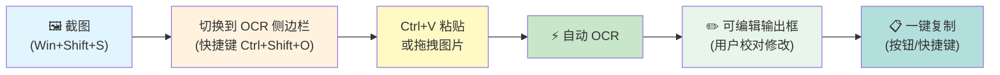
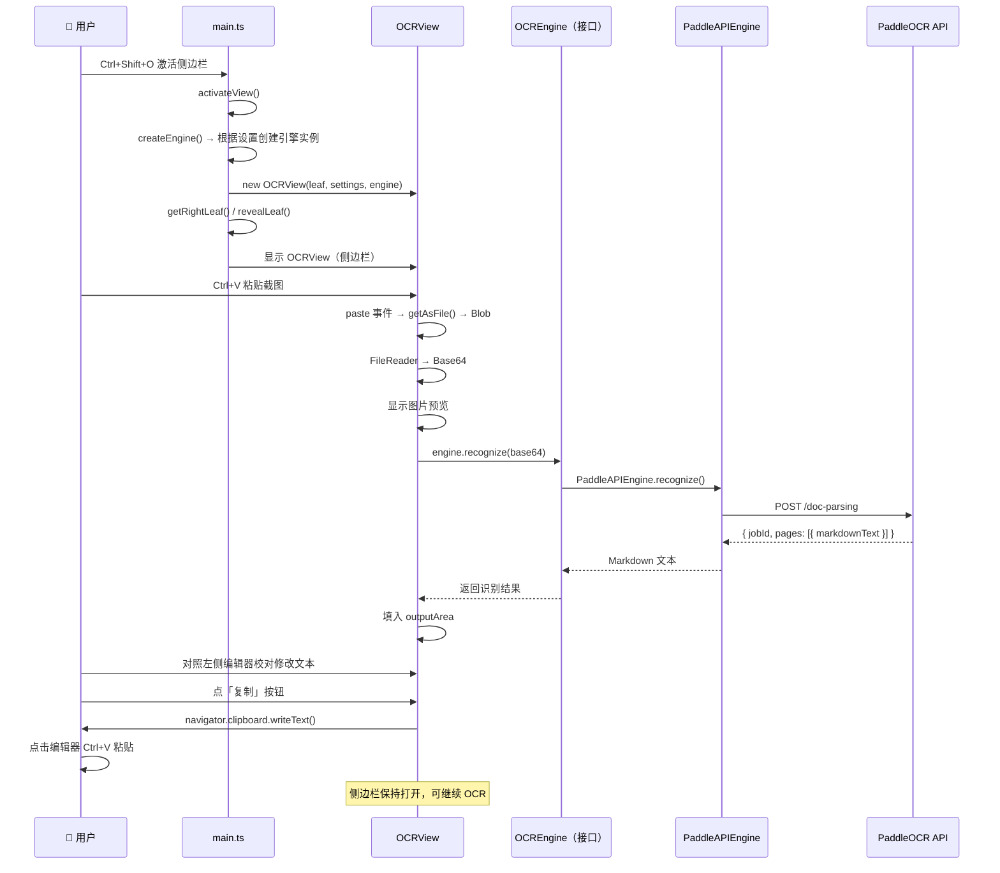

# Obsidian OCR 插件技术方案

## 一、项目概述

将现有的 Python CLI OCR 工具（`ocr_clipboard.py`）升级为一个 **Obsidian 插件**，提供可视化、可编辑的 OCR 体验。用户截图后，在侧边栏面板中粘贴图片即可自动识别文字，校对后一键复制到剪贴板，**与编辑器并排使用，无需来回切换**。

---

## 二、核心工作流



### 详细交互流程

```
1. 截图 (Win+Shift+S)
2. 按 Ctrl+Shift+O → 激活右侧 OCR 侧边栏（与编辑器并排显示）
3. 焦点切换到侧边栏，Ctrl+V 粘贴截图
4. 图片出现在预览区，自动开始 OCR
5. 2-3 秒后结果出现在下方编辑框
6. 对照原文校对修改（编辑器内容始终可见）
7. 点「复制」按钮（或 Ctrl+Enter）→ 文本进剪贴板
8. 回到编辑器 Ctrl+V 粘贴（侧边栏保持打开，可随时继续 OCR）
```

---

## 三、设计原则

| 原则 | 说明 |
|---|---|
| **所见即所得** | 侧边栏与编辑器并排，对照原文校对无需切换窗口 |
| **零额外依赖** | 仅依赖 Obsidian API + 浏览器内置 Web API，不引入第三方库 |
| **用户手势驱动** | 通过 paste/drop 事件获取图片，利用浏览器安全模型自动授权，无需额外权限 |
| **渐进增强** | 先保证核心 OCR + 编辑 + 复制流程可用，历史记录/批量/离线等作为后续扩展 |
| **容错优先** | API 未配置、网络超时、识别失败等场景均有明确提示和恢复路径 |

---

## 四、技术架构

### 4.1 项目结构

```
obsidian-ocr/
├── manifest.json              # Obsidian 插件清单
├── main.ts                    # 插件入口，注册视图和命令
├── src/
│   ├── OCRView.ts             # 侧边栏 ItemView（图片预览区 + 输出编辑区 + 按钮）
│   ├── OCREngine.ts           # OCR 引擎接口定义（抽象层）
│   ├── engines/
│   │   ├── PaddleAPIEngine.ts # PaddleOCR 云端 API 引擎（当前实现）
│   │   └── LocalDockerEngine.ts # 本地 Docker 部署引擎（预留）
│   └── settings.ts            # 设置面板（API URL / Token / 引擎选择）
├── styles.css                 # 侧边栏视图样式
├── package.json
├── tsconfig.json
└── esbuild.config.mjs         # 构建配置
```

### 4.2 模块职责

| 模块 | 职责 |
|---|---|
| `main.ts` | 插件生命周期管理，注册 ItemView（`VIEW_TYPE_OCR`），注册命令 `Ctrl+Shift+O` 激活视图，注册 Ribbon 图标，加载设置 |
| `OCRView.ts` | 侧边栏 ItemView 实现，包含图片预览区、可编辑 textarea、操作按钮，处理粘贴/拖拽事件，调用 OCR 引擎 |
| `OCREngine.ts` | **OCR 引擎抽象接口**，定义统一的 `recognize(base64: string): Promise<string>` 方法，供 OCRView 调用 |
| `engines/PaddleAPIEngine.ts` | PaddleOCR 云端 REST API 引擎实现，封装 HTTP 请求、错误处理、多页结果合并 |
| `engines/LocalDockerEngine.ts` | 本地 Docker 部署引擎预留实现，对接本地 PaddleOCR 服务（当前版本仅预留框架，设置面板中不显示相关选项） |
| `settings.ts` | Obsidian 设置面板，存储 `apiUrl`、`token`、`engineType`（api / local）等配置 |
| `styles.css` | 侧边栏视图样式美化 |

### 4.3 核心设计决策

| 决策点 | 选择 | 理由 |
|---|---|---|
| UI 模式 | **侧边栏 ItemView** | 与编辑器并排显示，对照原文校对更方便；面板常驻不消失，适合连续多次 OCR |
| 视图注册 | **`registerView()` + `VIEW_TYPE_OCR`** | Obsidian 标准 ItemView 模式，支持拖拽到任意面板位置 |
| 视图激活 | **`revealLeaf()` / `activateView()`** | 快捷键一键激活已有视图，不重复创建 |
| 图片获取 | **paste 事件 + `getAsFile()`** | 用户主动触发粘贴，浏览器自动授权，零权限风险 |
| OCR 引擎 | **策略模式（接口 + 实现）** | 通过 `OCREngine` 接口抽象，当前实现 `PaddleAPIEngine`（云端），预留 `LocalDockerEngine`（本地框架），OCRView 只依赖接口，切换引擎无需修改视图层。**当前版本仅支持云端 API 模式**，本地模式框架已预留，待后续版本开放 |
| 图片传输 | **Base64 编码** | 无需临时文件，直接通过 JSON 传输 |
| 输出格式 | **Markdown** | PaddleOCR 原生支持，保留排版结构 |

---

## 五、关键技术细节

### 5.1 paste 事件 vs clipboard API（核心设计优势）

```typescript
// ✅ 推荐：paste 事件 — 用户主动触发，Electron 100% 支持
dropZone.addEventListener('paste', (e: ClipboardEvent) => {
    const items = e.clipboardData?.items;
    if (!items) return;
    
    for (const item of items) {
        if (item.type.startsWith('image/')) {
            const blob = item.getAsFile();  
            // getAsFile() 在 paste 事件中始终可用，无需任何权限
            if (blob) this.handleImage(blob);
        }
    }
});

// ❌ 不推荐：navigator.clipboard.read() — 需要 Clipboard API 权限
const items = await navigator.clipboard.read();  // 可能被用户拒绝
```

**`e.clipboardData.items[x].getAsFile()` 在 Electron 中总是可用的原因：**
- `paste` 事件是用户主动触发（按 Ctrl+V），浏览器自动授予临时访问权限
- `navigator.clipboard.read()` 是程序化读取，需要用户显式授予 Clipboard 权限
- 这是 Web 安全模型的核心设计：用户手势授权 vs 程序化访问

### 5.2 PaddleOCR API 调用

#### API 接口详情

| 项目 | 值 |
|---|---|
| **请求方式** | `POST {API_URL}/doc-parsing` |
| **认证头** | `Authorization: token {TOKEN}` |
| **Content-Type** | `application/json` |
| **必传参数** | `file`（Base64 编码字符串）、`fileType`（1 = 图片） |

> **注意**：API 端点为 `/doc-parsing`（对应 `--model_type doc_parsing`），而非 `/layout-parsing`。

#### 请求体格式

```json
{
    "file": "<base64 编码的图片数据>",
    "fileType": 1,
    "useDocOrientationClassify": false,
    "useDocUnwarping": false,
    "useChartRecognition": false
}
```

#### 响应体格式

```json
{
    "jobId": "请求任务ID",
    "pages": [
        {
            "markdownText": "# 识别的 Markdown 文本内容",
            "markdownImages": {},
            "outputImages": {
                "layout_det_res": "https://...布局检测结果图URL..."
            }
        }
    ]
}
```

#### 错误码说明

| 错误码 | 说明 | 解决建议 |
|---|---|---|
| **403** | Token 错误 | 检查 Token 是否正确，或 URL 是否与 Token 匹配 |
| **413** | 请求体过大 | 请减少 PDF 文件的页数或文件大小（图片场景下通常是图片过大） |
| **422** | 参数无效 | 请参考 errorMsg 进行解决 |
| **429** | 超出单日解析最大页数 | 请使用其他模型或稍后再试 |
| **500** | 服务器内部错误 | 如果频繁遇到 500 问题，请联系 PaddleOCR 官方人员 |
| **503** | 当前请求过多 | 请稍后再试 |
| **504** | 网关超时 | 请稍后再试 |

#### TypeScript 调用实现

```typescript
// src/OCREngine.ts — OCR 引擎抽象接口
export interface OCREngine {
    recognize(base64Data: string): Promise<string>;
}
```

```typescript
// src/engines/PaddleAPIEngine.ts — PaddleOCR 云端 API 引擎实现
import { OCREngine } from '../OCREngine';

export class PaddleAPIEngine implements OCREngine {
    constructor(
        private apiUrl: string,
        private token: string
    ) {}

    async recognize(base64Data: string): Promise<string> {
        const response = await fetch(`${this.apiUrl}/doc-parsing`, {
            method: 'POST',
            headers: {
                'Authorization': `token ${this.token}`,
                'Content-Type': 'application/json'
            },
            body: JSON.stringify({
                file: base64Data,
                fileType: 1,                              // 1 = 图片
                useDocOrientationClassify: false,
                useDocUnwarping: false,
                useChartRecognition: false,
            })
        });

        if (!response.ok) {
            const errorMsg = this.getErrorMessage(response.status);
            throw new Error(errorMsg);
        }

        const data = await response.json();

        // 合并所有 pages 的识别结果
        if (!data.pages || data.pages.length === 0) {
            throw new Error('OCR 未返回识别结果');
        }

        const allText = data.pages
            .map((page: any) => page.markdownText ?? '')
            .filter((t: string) => t.trim() !== '')
            .join('\n\n');

        if (!allText) {
            throw new Error('OCR 识别结果为空');
        }

        return allText;
    }

    // 根据 HTTP 状态码返回用户友好的错误信息
    private getErrorMessage(status: number): string {
        const errorMap: Record<number, string> = {
            403: 'Token 错误，请检查 Token 是否正确，或 URL 是否与 Token 匹配',
            413: '请求体过大，请压缩图片后重试',
            422: '参数无效',
            429: '超出单日解析最大页数，请稍后再试',
            500: '服务器内部错误，请稍后再试或联系 PaddleOCR 官方',
            503: '当前请求过多，请稍后再试',
            504: '网关超时，请稍后再试',
        };
        return errorMap[status] ?? `OCR API 请求失败: ${status}`;
    }
}
```

```typescript
// src/engines/LocalDockerEngine.ts — 本地 Docker 引擎（预留，待实现）
import { OCREngine } from '../OCREngine';

export class LocalDockerEngine implements OCREngine {
    constructor(private localUrl: string = 'http://localhost:8866') {}

    async recognize(base64Data: string): Promise<string> {
        // TODO: 对接本地 PaddleOCR Docker 服务
        // 实现时可参考 PaddleAPIEngine 的结构
        throw new Error('本地引擎尚未实现，请使用云端 API 模式');
    }
}
```

### 5.3 Base64 编码处理

```typescript
// 从 paste/drop 事件获取的 File/Blob 转为 Base64
function blobToBase64(blob: Blob): Promise<string> {
    return new Promise((resolve, reject) => {
        const reader = new FileReader();
        reader.onloadend = () => {
            const result = reader.result as string;
            // 去掉 "data:image/png;base64," 前缀，只保留纯 Base64
            const base64 = result.split(',')[1];
            resolve(base64);
        };
        reader.onerror = reject;
        reader.readAsDataURL(blob);
    });
}
```

### 5.4 侧边栏视图 UI 结构

#### Obsidian 工作区整体布局

```
┌──────────────────────────────────────────────────────┐
│  📁 文件浏览器  │  📝 编辑器（笔记内容）  │  🔍 OCR  │
│                │                        │  侧边栏   │
│  - 笔记1.md   │  # 我的笔记             │ ┌───────┐ │
│  - 笔记2.md   │                        │ │📷预览 │ │
│  - 图片/      │  这里是参考原文...      │ │ 图片  │ │
│                │                        │ └───────┘ │
│                │  用户对照原文校对 OCR   │ ┌───────┐ │
│                │  识别结果，无需切换窗口 │ │输出框 │ │
│                │                        │ │(编辑) │ │
│                │                        │ └───────┘ │
│                │                        │[📋复制]  │
│                │                        │[🗑️清除]  │
└──────────────────────────────────────────────────────┘
```

#### OCR 侧边栏内部结构

```
┌───────────────────────────┐
│     🔍 OCR 文字识别        │  ← 视图标题（Tab 标签）
├───────────────────────────┤
│  ┌─────────────────────┐  │
│  │                     │  │
│  │  📷 拖拽图片到此处   │  │  ← 图片预览/拖放区
│  │     或 Ctrl+V 粘贴  │  │    (虚线边框占位)
│  │                     │  │
│  └─────────────────────┘  │
│         ⬇ 自动 OCR ⬇     │
│  ┌─────────────────────┐  │
│  │                     │  │
│  │ [识别的文字内容]     │  │  ← 可编辑输出框
│  │                     │  │    (textarea, 自适应高度)
│  │                     │  │
│  └─────────────────────┘  │
├───────────────────────────┤
│ 状态：✅ 已识别 128 字符   │  ← 状态栏
│ [📋 复制到剪贴板]         │  ← 按钮栏
│ [🗑️ 清除]                │
└───────────────────────────┘
```

> **侧边栏优势**：OCR 面板始终可见，用户在左侧编辑器中查看原文，右侧面板校对识别结果，实现"所见即所得"的校对体验。

---

## 六、关键代码骨架

### 6.1 插件入口 `main.ts`

```typescript
import { Plugin, WorkspaceLeaf } from 'obsidian';
import { OCRView, VIEW_TYPE_OCR } from './src/OCRView';
import { OCRSettingTab, OCRSettings } from './src/settings';
import { OCREngine } from './src/OCREngine';
import { PaddleAPIEngine } from './src/engines/PaddleAPIEngine';

const DEFAULT_SETTINGS: OCRSettings = {
    engineType: 'api',   // 'api' | 'local'
    apiUrl: '',
    token: '',
    localUrl: 'http://localhost:8866',
};

export default class OCRPlugin extends Plugin {
    settings: OCRSettings;

    // 根据设置创建 OCR 引擎实例
    private createEngine(): OCREngine {
        switch (this.settings.engineType) {
            case 'local':
                // 预留：本地 Docker 引擎
                // return new LocalDockerEngine(this.settings.localUrl);
                throw new Error('本地引擎尚未实现');
            case 'api':
            default:
                return new PaddleAPIEngine(this.settings.apiUrl, this.settings.token);
        }
    }

    async onload() {
        await this.loadSettings();

        // ── 注册 OCR 侧边栏视图 ──
        this.registerView(
            VIEW_TYPE_OCR,
            (leaf: WorkspaceLeaf) => new OCRView(leaf, this.settings, this.createEngine())
        );

        // ── Ribbon 图标（左侧栏图标按钮）──
        this.addRibbonIcon('scan', 'OCR 文字识别', () => {
            this.activateView();
        });

        // ── 注册命令：激活 OCR 侧边栏 ──
        this.addCommand({
            id: 'open-ocr-panel',
            name: '打开 OCR 侧边栏',
            hotkeys: [{ modifiers: ['Ctrl', 'Shift'], key: 'O' }],
            callback: () => this.activateView(),
        });

        // ── 注册设置面板 ──
        this.addSettingTab(new OCRSettingTab(this.app, this));
    }

    // ── 激活 OCR 视图（如果已存在则聚焦，否则创建）──
    async activateView() {
        const { workspace } = this.app;

        // 查找已有的 OCR 视图
        let leaf = workspace.getLeavesOfType(VIEW_TYPE_OCR)[0];
        if (!leaf) {
            // 在右侧边栏创建新 Leaf
            leaf = workspace.getRightLeaf(false);
            if (leaf) {
                await leaf.setViewState({
                    type: VIEW_TYPE_OCR,
                    active: true,
                });
            }
        }
        // 聚焦到 OCR 视图
        if (leaf) {
            workspace.revealLeaf(leaf);
        }
    }

    async loadSettings() {
        this.settings = Object.assign({}, DEFAULT_SETTINGS, await this.loadData());
    }

    async saveSettings() {
        await this.saveData(this.settings);
    }
}
```

### 6.2 OCRView 核心 `src/OCRView.ts`

```typescript
import { ItemView, WorkspaceLeaf, Notice } from 'obsidian';
import { OCREngine } from './OCREngine';
import { OCRSettings } from './settings';

export const VIEW_TYPE_OCR = 'ocr-panel';

export class OCRView extends ItemView {
    private settings: OCRSettings;
    private engine: OCREngine;  // OCR 引擎实例（由 main.ts 注入）
    private dropZone: HTMLElement;
    private outputArea: HTMLTextAreaElement;
    private statusBar: HTMLElement;
    private previewImg: HTMLImageElement;
    private placeholder: HTMLElement;
    private loadingOverlay: HTMLElement;
    private retryBtn: HTMLButtonElement;
    private lastBlob: Blob | null = null;  // 保存最后一次图片，用于重试

    constructor(leaf: WorkspaceLeaf, settings: OCRSettings, engine: OCREngine) {
        super(leaf);
        this.settings = settings;
        this.engine = engine;  // 注入 OCR 引擎，解耦具体实现
    }

    // ── ItemView 必须实现的属性 ──
    getViewType(): string {
        return VIEW_TYPE_OCR;
    }

    getDisplayText(): string {
        return 'OCR 文字识别';
    }

    getIcon(): string {
        return 'scan';
    }

    // ── 视图加载 ──
    async onOpen() {
        const container = this.contentEl;
        container.empty();
        container.addClass('ocr-view');

        // ── 图片拖放/粘贴区 ──
        this.dropZone = container.createEl('div', { cls: 'ocr-drop-zone' });
        this.previewImg = this.dropZone.createEl('img', { cls: 'ocr-preview' });
        this.previewImg.style.display = 'none';

        // ── 加载态遮罩（覆盖在图片上方）──
        this.loadingOverlay = this.dropZone.createEl('div', { cls: 'ocr-loading-overlay' });
        this.loadingOverlay.innerHTML = '🔍 识别中...';
        this.loadingOverlay.style.display = 'none';

        this.placeholder = this.dropZone.createEl('div', { cls: 'ocr-placeholder' });
        this.placeholder.innerHTML = '📷 拖拽图片到此处<br>或 <kbd>Ctrl+V</kbd> 粘贴';

        // ── 输出编辑区 ──
        this.outputArea = container.createEl('textarea', { cls: 'ocr-output' });
        this.outputArea.placeholder = 'OCR 识别结果将显示在此...';

        // ── 状态栏 ──
        this.statusBar = container.createEl('div', { cls: 'ocr-status-bar' });
        this.statusBar.textContent = '就绪';

        // ── 按钮栏 ──
        const buttonRow = container.createEl('div', { cls: 'ocr-buttons' });

        const copyBtn = buttonRow.createEl('button', {
            text: '📋 复制到剪贴板',
            cls: 'ocr-btn-primary'
        });
        copyBtn.addEventListener('click', () => this.copyToClipboard());

        const clearBtn = buttonRow.createEl('button', { text: '🗑️ 清除' });
        clearBtn.addEventListener('click', () => this.clear());

        // ── 重试按钮（默认隐藏，失败时显示）──
        this.retryBtn = buttonRow.createEl('button', {
            text: '🔄 重试',
            cls: 'ocr-btn-retry'
        });
        this.retryBtn.style.display = 'none';
        this.retryBtn.addEventListener('click', () => {
            if (this.lastBlob) this.handleImage(this.lastBlob);
        });

        // ── 粘贴事件（绑定到整个容器，无需焦点在特定元素）──
        container.addEventListener('paste', (e: ClipboardEvent) => {
            const items = e.clipboardData?.items;
            if (!items) return;

            for (const item of items) {
                if (item.type.startsWith('image/')) {
                    const blob = item.getAsFile();
                    if (blob) {
                        e.preventDefault();
                        this.handleImage(blob);
                        return;
                    }
                }
            }
        });

        // ── 拖拽事件 ──
        this.dropZone.addEventListener('dragover', (e) => e.preventDefault());
        this.dropZone.addEventListener('drop', (e: DragEvent) => {
            e.preventDefault();
            const file = e.dataTransfer?.files?.[0];
            if (file && file.type.startsWith('image/')) {
                this.handleImage(file);
            }
        });

        // ── 快捷键：Ctrl+Enter 复制 ──
        container.addEventListener('keydown', (e: KeyboardEvent) => {
            if (e.ctrlKey && e.key === 'Enter') {
                e.preventDefault();
                this.copyToClipboard();
            }
        });
    }

    // ── 视图关闭（清理资源）──
    async onClose() {
        // 释放 ObjectURL
        if (this.previewImg.src && this.previewImg.src.startsWith('blob:')) {
            URL.revokeObjectURL(this.previewImg.src);
        }
    }

    // ── 处理图片 ──
    private async handleImage(blob: Blob) {
        // 设置校验：调用前检查配置
        if (!this.settings.apiUrl || !this.settings.token) {
            new Notice('⚠️ 请先在设置中配置 API URL 和 Access Token');
            return;
        }

        // 保存 blob 用于重试
        this.lastBlob = blob;

        // 释放旧的 ObjectURL，防止内存泄漏
        if (this.previewImg.src && this.previewImg.src.startsWith('blob:')) {
            URL.revokeObjectURL(this.previewImg.src);
        }

        // 显示预览
        const url = URL.createObjectURL(blob);
        this.previewImg.src = url;
        this.previewImg.style.display = 'block';
        this.placeholder.style.display = 'none';
        this.retryBtn.style.display = 'none';

        // Base64 编码
        const base64 = await this.blobToBase64(blob);

        // 显示加载态遮罩
        this.loadingOverlay.style.display = 'flex';
        this.statusBar.textContent = '🔍 正在识别...';

        try {
            // 通过引擎接口调用，不直接依赖具体实现
            const text = await this.engine.recognize(base64);
            this.outputArea.value = text;
            this.statusBar.textContent = `✅ 已识别 ${text.length} 字符`;
        } catch (err) {
            const msg = err instanceof Error ? err.message : '未知错误';
            this.statusBar.textContent = `❌ 识别失败: ${msg}`;
            new Notice(`OCR 识别失败: ${msg}`);
            this.retryBtn.style.display = '';  // 失败时显示重试按钮
        } finally {
            this.loadingOverlay.style.display = 'none';
        }
    }

    // ── 复制到剪贴板 ──
    private async copyToClipboard() {
        const text = this.outputArea.value;
        if (!text) {
            new Notice('没有可复制的内容');
            return;
        }
        await navigator.clipboard.writeText(text);
        this.statusBar.textContent = '📋 已复制到剪贴板！';
        new Notice('已复制到剪贴板');
    }

    // ── 清除 ──
    private clear() {
        this.outputArea.value = '';
        // 释放 ObjectURL 防止内存泄漏
        if (this.previewImg.src && this.previewImg.src.startsWith('blob:')) {
            URL.revokeObjectURL(this.previewImg.src);
        }
        this.previewImg.src = '';
        this.previewImg.style.display = 'none';
        this.placeholder.style.display = '';
        this.loadingOverlay.style.display = 'none';
        this.retryBtn.style.display = 'none';
        this.lastBlob = null;
        this.statusBar.textContent = '就绪';
    }

    // ── Blob → Base64 ──
    private blobToBase64(blob: Blob): Promise<string> {
        return new Promise((resolve, reject) => {
            const reader = new FileReader();
            reader.onloadend = () => resolve((reader.result as string).split(',')[1]);
            reader.onerror = reject;
            reader.readAsDataURL(blob);
        });
    }
}
```

### 6.3 加载态样式 `styles.css`（关键片段）

```css
/* 图片拖放区（需要 relative 定位，供 loading 遮罩 absolute 参考） */
.ocr-drop-zone {
    position: relative;
}

/* 加载态遮罩 */
.ocr-loading-overlay {
    position: absolute;
    inset: 0;
    display: flex;
    align-items: center;
    justify-content: center;
    background: rgba(0, 0, 0, 0.5);
    color: #fff;
    font-size: 1.1em;
    border-radius: 8px;
    z-index: 10;
    animation: ocr-pulse 1.5s ease-in-out infinite;
}

@keyframes ocr-pulse {
    0%, 100% { opacity: 0.7; }
    50% { opacity: 1; }
}

/* 重试按钮 */
.ocr-btn-retry {
    background: var(--text-warning);
    color: var(--text-on-warning);
}
```

---

## 七、设置面板

### 配置项

| 设置项 | 类型 | 说明 | 默认值 |
|---|---|---|---|
| **API URL** | `string` | PaddleOCR API 地址，从 [AI Studio](https://aistudio.baidu.com/paddleocr/task) 获取 | 空 |
| **Access Token** | `string`（密码字段） | PaddleOCR 访问令牌 | 空 |

> **注意**：引擎类型选择和本地服务地址配置已预留框架（见 4.2 模块职责），但当前版本仅支持云端 API 模式，设置面板中暂不显示相关选项。后续版本支持本地模式时再开放。

### 获取 Token 和 API URL

1. 访问 [PaddleOCR 官网](https://aistudio.baidu.com/paddleocr/task)
2. 在 API 调用示例中获取 `API_URL` 和 `TOKEN`
3. 填入插件的设置面板

---

## 八、工作流完整流程

### 用户操作流程

```
┌──────────────────────────────────────────────────────────┐
│  步骤 1: 截图                                             │
│  按 Win+Shift+S，框选需要 OCR 的区域                       │
├──────────────────────────────────────────────────────────┤
│  步骤 2: 打开 OCR 侧边栏                                   │
│  在 Obsidian 中按 Ctrl+Shift+O                           │
│  → 右侧边栏出现 OCR 面板，与编辑器并排显示                   │
├──────────────────────────────────────────────────────────┤
│  步骤 3: 粘贴截图                                         │
│  按 Ctrl+V（或拖拽图片到虚线框）                           │
│  → 图片显示在预览区                                       │
│  → 自动开始 OCR 识别                                      │
├──────────────────────────────────────────────────────────┤
│  步骤 4: 等待识别                                         │
│  → 状态栏显示 "🔍 正在识别..."                            │
│  → 2-3 秒后结果显示在下方编辑框                            │
│  → 状态栏显示 "✅ 已识别 N 字符"                          │
├──────────────────────────────────────────────────────────┤
│  步骤 5: 校对修改                                         │
│  左侧编辑器显示原文，右侧面板对照校对                       │
│  在输出框中直接编辑，修正可能存在的识别错误                  │
├──────────────────────────────────────────────────────────┤
│  步骤 6: 复制结果                                         │
│  点击「📋 复制到剪贴板」按钮（或按 Ctrl+Enter）            │
│  → 状态栏显示 "📋 已复制到剪贴板！"                        │
├──────────────────────────────────────────────────────────┤
│  步骤 7: 粘贴到编辑器                                      │
│  点击左侧编辑器获取焦点                                    │
│  Ctrl+V 粘贴文本（OCR 面板保持打开，可继续使用）             │
└──────────────────────────────────────────────────────────┘
```

### 系统内部流程



---

## 九、依赖与兼容性

### 零第三方依赖

| 依赖 | 来源 | 说明 |
|---|---|---|
| `obsidian` | Obsidian API | 插件运行时由 Obsidian 提供 |
| `fetch()` | 浏览器内置 | 标准 Web API，无需安装 |
| `FileReader` | 浏览器内置 | 标准 Web API，无需安装 |
| `navigator.clipboard` | 浏览器内置 | 标准 Web API，无需安装 |

**不需要 pip 安装任何 Python 包，不需要 Node.js 额外依赖。**

### 平台兼容性

| 平台 | 支持 | 说明 |
|---|---|---|
| Windows | ✅ | 主要目标平台，Win+Shift+S 截图 |
| macOS | ✅ | Cmd+Shift+4 截图，快捷键适配 Cmd |
| Linux | ✅ | 取决于桌面环境的截图工具 |

---

## 十、工作量估算

| 阶段 | 模块 | 工时 | 说明 |
|---|---|---|---|
| 1 | 项目脚手架 | 0.5h | manifest.json / tsconfig / esbuild 配置 |
| 2 | OCRView UI | 2.5h | 图片预览区 + 输出框 + 按钮栏 + 拖放区 + 加载态遮罩 + 响应式布局 |
| 3 | 粘贴/拖拽事件 | 1h | paste + drop 事件处理 + Base64 编码 + 图片压缩 + 网络检测 |
| 4 | PaddleOCR API | 1.5h | fetch 封装 + 错误处理 + 多页结果合并 + 设置校验 + 超时控制 |
| 5 | 设置面板 | 1h | API URL / Token 配置 + 密码字段遮蔽 + 配置验证 |
| 6 | 样式美化 | 1.5h | 侧边栏视觉设计 + 虚线框 + 加载动画 + 重试按钮 + 响应式适配 |
| 7 | 离线降级处理 | 0.5h | 网络检测 + 本地服务检查 + 降级提示逻辑 |
| 8 | 测试调试 | 2h | 端到端测试 + 边界情况验证 + 兼容性测试 + 错误场景覆盖 |
| 9 | 文档与打包 | 0.5h | README 编写 + 构建产物整理 + 本地安装测试 |
| **合计** | | **≈ 11h** | 预留 1-2h 缓冲，总计 10-12h |

> **工时说明**：
> - 比初始估算增加约 4 小时，主要增加在 UI 细节打磨、离线降级处理和更充分的测试上
> - 实际开发中可能因 Obsidian API 细节问题需要额外调试时间
> - 建议分 2-3 天完成，每天 4-5 小时，避免疲劳导致的代码质量下降

---

## 十一、性能优化策略

### 11.1 图片压缩

对于大图片（超过 10MB），在转 Base64 前进行压缩，减少传输数据量和处理时间。**压缩策略需平衡文件大小与 OCR 精度**，避免过度压缩导致识别率下降。

#### 压缩策略

| 条件 | 处理方式 | 目标 |
|---|---|---|
| **文件大小 ≤ 10MB** | 不压缩，直接使用 | 保持原始质量 |
| **文件大小 > 10MB** | 按比例缩放 + 质量压缩 | 降至 10MB 以内 |
| **分辨率 > 4000px 宽** | 缩放至 4000px 宽（保持宽高比） | 避免超大图片处理超时 |
| **分辨率 < 800px 宽** | 不压缩（即使文件较大） | 保证 OCR 识别精度 |

#### OCR 精度保护原则

1. **最小分辨率保障**：压缩后图片宽度不低于 800px，确保文字清晰可辨
2. **优先缩放尺寸**：先调整分辨率，再压缩质量，减少对文字边缘的损失
3. **质量下限**：JPEG 质量不低于 0.7，避免产生明显噪点干扰 OCR
4. **格式选择**：优先使用 PNG（无损），仅在文件过大时转为 JPEG

#### 实现代码

```typescript
// 压缩配置常量
const COMPRESS_CONFIG = {
    MAX_FILE_SIZE_MB: 10,        // 触发压缩的文件大小阈值
    MAX_WIDTH_PX: 4000,          // 最大宽度限制
    MIN_WIDTH_PX: 800,           // 最小宽度保障（OCR 精度）
    JPEG_QUALITY: 0.8,           // JPEG 压缩质量（0.7-0.9 适合 OCR）
    PREFER_FORMAT: 'image/png',  // 优先使用 PNG（无损）
};

// 图片压缩函数
async function compressImage(blob: Blob): Promise<Blob> {
    const sizeMB = blob.size / (1024 * 1024);
    
    // 小文件直接返回
    if (sizeMB <= COMPRESS_CONFIG.MAX_FILE_SIZE_MB) {
        return blob;
    }

    return new Promise((resolve, reject) => {
        const img = new Image();
        img.onload = () => {
            const canvas = document.createElement('canvas');
            const ctx = canvas.getContext('2d')!;
            
            let targetWidth = img.width;
            let targetHeight = img.height;
            
            // 1. 限制最大宽度（避免超大图片）
            if (targetWidth > COMPRESS_CONFIG.MAX_WIDTH_PX) {
                const ratio = COMPRESS_CONFIG.MAX_WIDTH_PX / targetWidth;
                targetWidth = COMPRESS_CONFIG.MAX_WIDTH_PX;
                targetHeight = Math.round(img.height * ratio);
            }
            
            // 2. 保障最小宽度（OCR 精度）
            if (targetWidth < COMPRESS_CONFIG.MIN_WIDTH_PX) {
                console.warn(`图片宽度 ${targetWidth}px 较小，可能影响 OCR 精度`);
                // 不放大，保持原始尺寸
                targetWidth = img.width;
                targetHeight = img.height;
            }
            
            canvas.width = targetWidth;
            canvas.height = targetHeight;
            
            // 绘制缩放后的图片
            ctx.drawImage(img, 0, 0, targetWidth, targetHeight);
            
            // 3. 尝试 PNG 格式（无损）
            canvas.toBlob(
                (pngBlob) => {
                    if (pngBlob && pngBlob.size / (1024 * 1024) <= COMPRESS_CONFIG.MAX_FILE_SIZE_MB) {
                        resolve(pngBlob);
                    } else {
                        // PNG 仍然过大，使用 JPEG 压缩
                        canvas.toBlob(
                            (jpegBlob) => resolve(jpegBlob!),
                            'image/jpeg',
                            COMPRESS_CONFIG.JPEG_QUALITY
                        );
                    }
                },
                COMPRESS_CONFIG.PREFER_FORMAT
            );
        };
        img.onerror = reject;
        img.src = URL.createObjectURL(blob);
    });
}

// 使用示例
async function handleImageWithCompression(blob: Blob) {
    const originalSize = (blob.size / (1024 * 1024)).toFixed(2);
    const compressedBlob = await compressImage(blob);
    const compressedSize = (compressedBlob.size / (1024 * 1024)).toFixed(2);
    
    if (blob !== compressedBlob) {
        new Notice(`📦 图片已压缩: ${originalSize}MB → ${compressedSize}MB`);
    }
    
    // 继续处理...
}
```

**使用场景**：
- 在 `handleImage()` 中，Base64 编码前调用 `compressImage()`
- 超过 10MB 的图片自动压缩
- 压缩后显示提示："图片已压缩至 X MB"
- 如果图片宽度小于 800px，控制台警告可能影响精度

### 11.2 网络状态检测与离线降级

在发起 API 请求前检测网络状态，避免无效请求。**当网络不可用时，根据当前引擎类型提供相应的降级提示**。

#### 离线降级策略

| 场景 | 当前引擎 | 提示信息 | 操作建议 |
|---|---|---|---|
| 网络断开 | 云端 API | "⚠️ 网络不可用，云端 OCR 无法使用" | 提示切换本地模式或检查网络 |
| 网络断开 + 本地引擎未部署 | 本地 Docker | "⚠️ 本地 OCR 服务未部署" | 提示部署本地服务 |
| 网络断开 + 本地引擎已配置 | 本地 Docker | 继续使用本地服务 | 正常工作 |

#### 实现代码

```typescript
// 网络状态检测
function isOnline(): boolean {
    return navigator.onLine;
}

// 离线降级处理
function handleOfflineScenario(settings: OCRSettings): boolean {
    if (isOnline()) {
        return true; // 网络正常，继续执行
    }
    
    // 网络断开时的处理逻辑
    switch (settings.engineType) {
        case 'api':
            // 云端 API 模式：提示切换本地模式
            new Notice('⚠️ 网络不可用，云端 OCR 无法使用。\n请切换到本地模式或检查网络连接。', 5000);
            return false;
            
        case 'local':
            // 本地模式：检查本地服务是否可用
            // 这里可以尝试 ping 本地服务
            checkLocalService(settings.localUrl)
                .then(isAvailable => {
                    if (!isAvailable) {
                        new Notice('⚠️ 本地 OCR 服务未部署或未启动。\n请先部署本地 PaddleOCR 服务。', 8000);
                    }
                });
            return true; // 让用户尝试连接本地服务
            
        default:
            new Notice('⚠️ 网络不可用，请检查网络连接。', 5000);
            return false;
    }
}

// 检查本地服务是否可用
async function checkLocalService(localUrl: string): Promise<boolean> {
    try {
        const response = await fetch(`${localUrl}/health`, {
            method: 'GET',
            signal: AbortSignal.timeout(3000) // 3秒超时
        });
        return response.ok;
    } catch {
        return false;
    }
}

// 在 handleImage() 中使用
private async handleImage(blob: Blob) {
    // 检查网络状态和引擎可用性
    if (!handleOfflineScenario(this.settings)) {
        return;
    }
    
    // 继续原有逻辑...
}
```

#### 用户提示示例

**场景 1：云端模式 + 网络断开**
```
⚠️ 网络不可用，云端 OCR 无法使用。
请切换到本地模式或检查网络连接。
```

**场景 2：本地模式 + 服务未部署**
```
⚠️ 本地 OCR 服务未部署或未启动。
请先部署本地 PaddleOCR 服务。
部署指南：https://github.com/PaddlePaddle/PaddleOCR
```

**场景 3：本地模式 + 服务正常**
```
✅ 使用本地 OCR 服务（离线模式）
```

### 11.3 请求超时控制

为 API 请求设置合理的超时时间（如 30 秒），避免长时间等待。

```typescript
// 带超时的 fetch
async function fetchWithTimeout(url: string, options: RequestInit, timeout: number = 30000): Promise<Response> {
    const controller = new AbortController();
    const timeoutId = setTimeout(() => controller.abort(), timeout);
    
    try {
        const response = await fetch(url, { ...options, signal: controller.signal });
        return response;
    } finally {
        clearTimeout(timeoutId);
    }
}
```

### 11.4 图片尺寸限制

在图片预处理阶段检查尺寸，超出限制时给出提示。

```typescript
// 图片尺寸检查
const MAX_IMAGE_SIZE = 10 * 1024 * 1024; // 10MB

async function validateAndCompressImage(blob: Blob): Promise<Blob> {
    if (blob.size > MAX_IMAGE_SIZE) {
        new Notice('⚠️ 图片较大，正在压缩...');
        return await compressImage(blob, MAX_IMAGE_SIZE / (1024 * 1024));
    }
    return blob;
}
```

---

## 十二、风险与对策

| 风险 | 概率 | 影响 | 对策 |
|---|---|---|---|
| PaddleOCR API 不可用/限流 | 低 | 高 | 在设置面板中显示配额信息，推荐用户关注 API 配额；失败时显示重试按钮 |
| 大图片 Base64 编码超时 | 中 | 中 | 限制图片大小（如超过 10MB 提示压缩），加载态遮罩提供视觉反馈 |
| ObjectURL 内存泄漏 | 中 | 中 | 每次新图片/清除/关闭视图前调用 `URL.revokeObjectURL()` |
| API 响应结构变更 | 低 | 中 | 对 `pages` 做空值保护，异常时给出明确错误提示 |
| Obsidian API 版本不兼容 | 低 | 中 | 在 manifest.json 中声明最低版本要求 |
| 快捷键 Ctrl+Shift+O 冲突 | 低 | 低 | 文档中提示用户可在 Obsidian 设置中自定义快捷键 |
| **网络断开导致云端 OCR 不可用** | 中 | 高 | 自动检测网络状态，提示切换本地模式；本地模式下检查服务可用性，未部署时提供部署指南链接 |
| **图片过度压缩导致 OCR 精度下降** | 低 | 中 | 压缩策略保障最小分辨率（800px），优先缩放尺寸再压缩质量，质量下限 0.7 |
| **本地 PaddleOCR 服务未部署** | 中 | 中 | 在离线提示中提供部署指南链接，引导用户完成本地服务搭建 |

---

## 十三、测试策略

### 13.1 测试用例矩阵

| 测试类别 | 测试场景 | 预期结果 | 优先级 |
|---|---|---|---|
| **正常功能** | 粘贴小图片（<1MB） | 成功识别并显示结果 | P0 |
| **正常功能** | 拖拽图片到预览区 | 成功识别并显示结果 | P0 |
| **正常功能** | 点击复制按钮 | 文本复制到剪贴板 | P0 |
| **正常功能** | 按 Ctrl+Enter | 文本复制到剪贴板 | P0 |
| **边界情况** | 粘贴大图片（>10MB） | 自动压缩后成功识别 | P1 |
| **边界情况** | 粘贴空图片/无效图片 | 显示错误提示 | P1 |
| **边界情况** | OCR 返回空结果 | 显示"识别结果为空"提示 | P1 |
| **边界情况** | 连续粘贴多张图片 | 每次都能正确识别 | P1 |
| **错误处理** | Token 无效（403） | 显示"Token 错误"提示 | P0 |
| **错误处理** | 请求体过大（413） | 显示"请求体过大"提示 | P1 |
| **错误处理** | 参数无效（422） | 显示具体错误信息 | P1 |
| **错误处理** | 超出配额（429） | 显示"超出配额"提示 | P1 |
| **错误处理** | 服务器错误（500） | 显示"服务器错误"提示 | P1 |
| **错误处理** | 请求过多（503） | 显示"请求过多"提示 | P1 |
| **错误处理** | 网关超时（504） | 显示"网关超时"提示 | P1 |
| **错误处理** | 网络断开 | 显示"网络不可用"提示 | P0 |
| **错误处理** | API 未配置 | 显示"请先配置 API"提示 | P0 |
| **错误处理** | 网络断开 + 云端模式 | 显示"网络不可用，请切换本地模式"提示 | P0 |
| **错误处理** | 网络断开 + 本地模式 + 服务未部署 | 显示"本地服务未部署"提示及部署指南 | P1 |
| **错误处理** | 网络断开 + 本地模式 + 服务正常 | 使用本地服务正常识别 | P1 |
| **资源管理** | 切换图片时释放旧 ObjectURL | 无内存泄漏 | P2 |
| **资源管理** | 关闭视图时释放资源 | 无内存泄漏 | P2 |
| **UI 交互** | 加载态遮罩显示 | 遮罩正确显示/隐藏 | P1 |
| **UI 交互** | 重试按钮显示/隐藏 | 失败时显示，成功时隐藏 | P1 |
| **UI 交互** | 状态栏信息更新 | 实时更新识别状态 | P1 |

### 13.2 测试工具与方法

| 测试类型 | 工具/方法 | 说明 |
|---|---|---|
| **端到端测试** | 手动测试 | **优先级最高**，完整用户流程测试，在 Obsidian 中实际操作 |
| **集成测试** | Obsidian 开发者控制台 | 测试插件加载、视图注册、事件绑定 |
| **边界测试** | 准备测试图片集 | 包含不同尺寸、格式、质量的图片 |
| **错误测试** | 模拟网络断开/无效 Token | 测试错误处理逻辑 |
| **单元测试** | Jest（可选） | 后续优化时添加，测试独立函数如 Base64 编码、图片压缩等 |

> **测试策略说明**：由于 Obsidian 插件的测试环境搭建比较复杂，**优先保证手动测试覆盖核心流程**。单元测试作为后续优化方向，在插件稳定运行后再考虑添加。

### 13.3 测试图片集

准备以下测试图片：

| 图片类型 | 尺寸 | 大小 | 用途 |
|---|---|---|---|
| 小图片 | 800x600 | <1MB | 正常功能测试 |
| 中图片 | 1920x1080 | 2-5MB | 性能测试 |
| 大图片 | 4000x3000 | >10MB | 压缩功能测试 |
| 超大图片 | 8000x6000 | >20MB | 边界测试 |
| 空图片 | 0x0 | 0KB | 错误处理测试 |
| 无效文件 | - | - | 错误处理测试 |
| 小分辨率图片 | 400x300 | <500KB | OCR 精度保障测试（验证最小分辨率提示） |
| 高质量 PNG | 2000x1500 | 15MB | PNG 格式优先测试 |
| 低质量 JPEG | 2000x1500 | 500KB | 压缩质量下限测试 |

### 13.4 测试流程

1. **开发阶段**：每个功能完成后立即测试
2. **集成阶段**：所有功能完成后进行端到端测试
3. **发布前**：完整测试矩阵覆盖
4. **发布后**：收集用户反馈，持续改进

---

## 十四、部署与发布

### 14.1 构建插件

```bash
# 安装依赖
npm install

# 构建生产版本
npm run build
```

构建后生成以下文件（用于发布）：
- `main.js` — 编译后的插件代码
- `manifest.json` — 插件清单
- `styles.css` — 样式文件

### 14.2 本地安装测试

1. 在 Obsidian 库目录下创建 `.obsidian/plugins/obsidian-ocr/` 文件夹
2. 将 `main.js`、`manifest.json`、`styles.css` 复制到该文件夹
3. 在 Obsidian 设置 → 第三方插件中启用该插件

### 14.3 发布到 Obsidian 社区插件

1. **准备 GitHub 仓库**
   - 创建公开仓库（如 `obsidian-ocr`）
   - 推送代码并创建 Release（Tag 格式需与 `manifest.json` 中的版本号一致）
   - Release 包含 `main.js`、`manifest.json`、`styles.css` 三个文件

2. **提交到 Obsidian 插件仓库**
   - Fork [obsidianmd/obsidian-releases](https://github.com/obsidianmd/obsidian-releases)
   - 在 `community-plugins.json` 中添加插件信息：
     ```json
     {
         "id": "obsidian-ocr",
         "name": "OCR 文字识别",
         "author": "Your Name",
         "description": "截图 OCR 文字识别，侧边栏可视化校对，一键复制",
         "repo": "your-username/obsidian-ocr"
     }
     ```
   - 提交 PR，等待审核通过

3. **版本更新流程**
   - 更新 `manifest.json` 中的版本号
   - 更新 `versions.json`（记录版本与最低 Obsidian 版本的映射）
   - 创建新的 GitHub Release
   - Obsidian 社区插件会自动检测更新

### 14.4 目录结构（构建产物）

```
.obsidian/plugins/obsidian-ocr/
├── main.js              # 编译后的插件代码
├── manifest.json        # 插件清单
└── styles.css           # 样式文件
```

---

## 十五、后续扩展方向

- [ ] **历史记录**：保存最近的 OCR 结果，支持回溯
- [ ] **批量处理**：支持一次粘贴多张图片，逐张识别，结果追加
- [ ] **语言选择**：在设置中指定 OCR 目标语言
- [ ] **直接插入**：支持一键插入到编辑器光标位置（不经过剪贴板）
- [ ] **离线模式**：开放本地 PaddleOCR 服务配置（如 Docker 部署），支持完全离线使用
- [ ] **截图热键**：内置截图触发按钮，一键截图 + OCR
- [ ] **图片预处理**：自动调整亮度、对比度、锐化，提升 OCR 识别率

---

## 十六、总结

| 评估维度 | 结论 |
|---|---|
| **技术可行性** | ✅ **100%** |
| **核心风险点** | ✅ **已全部消除** |
| **paste 事件获取图片** | ✅ Electron 中 `getAsFile()` 始终可用，零权限 |
| **UI 模式** | ✅ **侧边栏 ItemView**，与编辑器并排，对照校对更方便 |
| **PaddleOCR HTTP API** | ✅ 标准 REST API，`fetch()` 直接调用，多页结果自动合并 |
| **零第三方依赖** | ✅ 仅使用浏览器内置 Web API |
| **离线降级处理** | ✅ 网络检测 + 本地服务检查 + 智能提示 |
| **图片压缩策略** | ✅ 平衡文件大小与 OCR 精度，保障最小分辨率 |
| **开发工时** | ≈ 10-12 小时（含缓冲时间） |
| **用户体验** | ⭐⭐⭐⭐⭐ 侧边栏常驻、可视化、可编辑、一键复制、失败可重试、离线智能提示 |
